!!! danger "Important: Read Before Use!"
	!!! warning "ESD Sensitivity"
		The mosaic-X5 module is sensitive to [ESD](https://en.wikipedia.org/wiki/Electrostatic_discharge "Electrostatic Discharge"). Use a proper grounding system to make sure that the working surface and the components are at the same electric potential.

		??? info "ESD Precaution"
			As recommended by the manufacturer, we highly recommend that users take the necessary precautions to avoid damaging their module.

			- The Tri-band GNSS RTK breakout board features ESD protection on the USB-C connector and breakout's I/O:
				- USB data lines
				- I/O PTH pads
				- JST connector's pins
			- The mosaic-X5 module features internal ESD protection to the `ANT_1` antenna input.

			

			

			

			<article class="video-500px">
			<iframe src="https://www.youtube.com/embed/hrL5J6Q5gX8?si=jOPBat8rzMnL7Uz4&amp;start=26;&amp;end=35;" title="Septentrio: Getting Started Video (playback starts at ESD warning)" frameborder="0" allow="accelerometer; autoplay; clipboard-write; encrypted-media; gyroscope; picture-in-picture" allowfullscreen></iframe>
			</article>
			

			

			-   <a href="https://www.sparkfun.com/products/25572">
				<figure markdown>
				
				</figure>		

				---

				**iFixit Anti-Static Wrist Strap** 
				TOL-25572</a>

			

	!!! warning "Active Antenna"
		Never inject an external DC voltage into the SMA connector for the GPS antenna, as it may damage the mosaic-X5 module. For instance, when using a splitter to distribute the antenna signal to several GNSS receivers, make sure that no more than one output of the splitter passes DC. Use [DC-blocks](https://en.wikipedia.org/wiki/DC_block) otherwise.

		??? info
			A 3 - 5.5V DC voltage can be applied to the main antenna from the `VANT` pin, obviating the need for an external antenna supply or [bias-tee](https://en.wikipedia.org/wiki/Bias_tee).

## USB Programming
The USB connection is utilized for programming and serial communication. Users only need to plug their Tri-band GNSS RTK breakout board into a computer using a USB-C cable.

<figure markdown>
[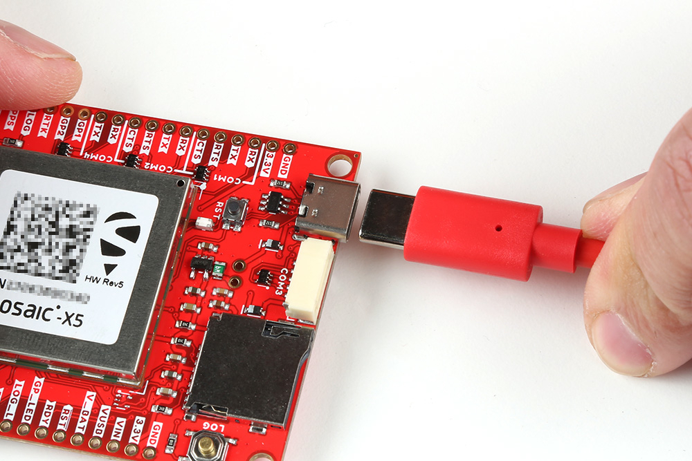{ width="400" }](./assets/img/hookup_guide/assembly-usb.jpg "Click to enlarge")
<figcaption markdown>The Tri-band GNSS RTK breakout board with USB-C cable being attached.</figcaption>
</figure>

## GPS Antenna
In order to receive [GNSS](https://en.wikipedia.org/wiki/Satellite_navigation "Global Navigation Satellite System") signals, users will need to connect a compatible antenna. For the best performance, we recommend users choose an active, L1/L2/L5 (tri-band) GNSS antenna and utilize a low-loss cable.

<figure markdown>
[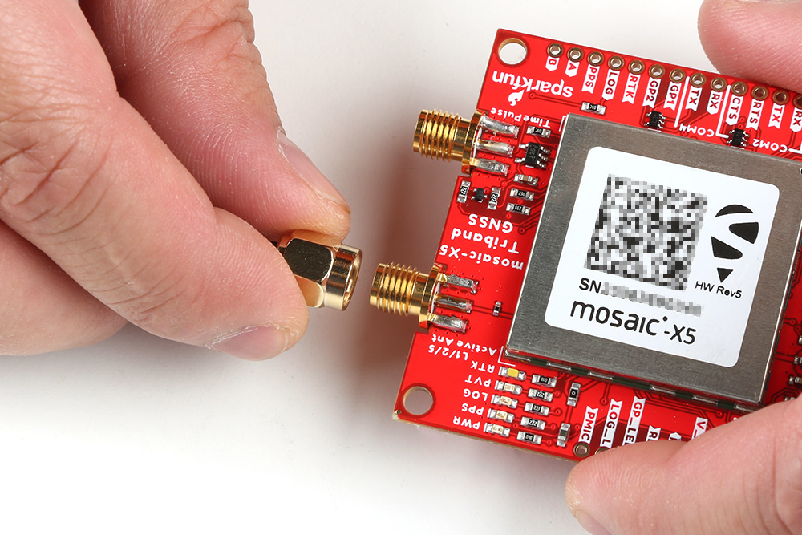{ width="400" }](./assets/img/hookup_guide/assembly-gps_antenna.jpg "Click to enlarge")
<figcaption markdown>Attaching a GPS antenna to the SMA connector on the Tri-band GNSS RTK breakout board.</figcaption>
</figure>

## SD Card
An &micro;SD card slot is available for users to log and store data, locally on the board. Users, will need to insert a compatible SD card and configure the mosaic-X5 module for data logging.

<figure markdown>
[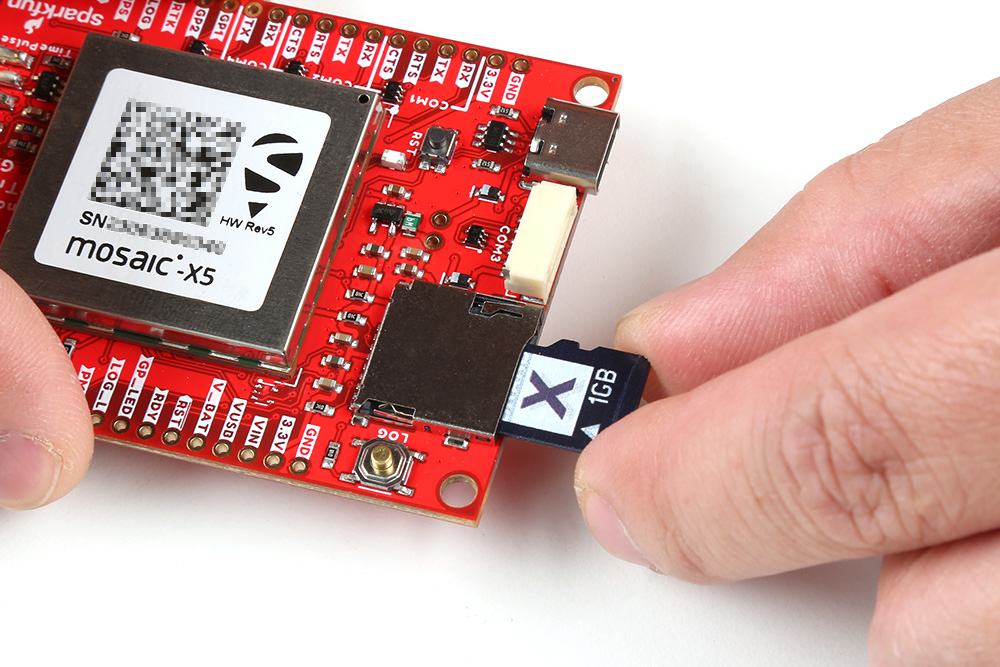{ width="400" }](./assets/img/hookup_guide/assembly-sd_card.jpg "Click to enlarge")
<figcaption markdown>Inserting an SD card into the Tri-band GNSS RTK breakout board.</figcaption>
</figure>

??? tip
	There are multiple ways to configure and enable data logging to an SD card. However, the simplest method is with the ++"LOG"++ button.

	* Pressing the ++"LOG"++ button *(< 5s)* toggles data logging to the SD card on and off.
	* Holding the ++"LOG"++ button for more than 5 seconds *(> 5s)* and then releasing it, will force the board to:
		* Unmount the SD card if it was mounted
		* Mount the SD card if it was unmounted

	For more information, please reference the [SD Card Slot](../hardware_overview/#sd-card-slot) section.

## JST Connector
The JST connector on the Tri-band GNSS RTK board, breaks out the `COM3` UART port of the mosaic-X5 module.

<figure markdown>
[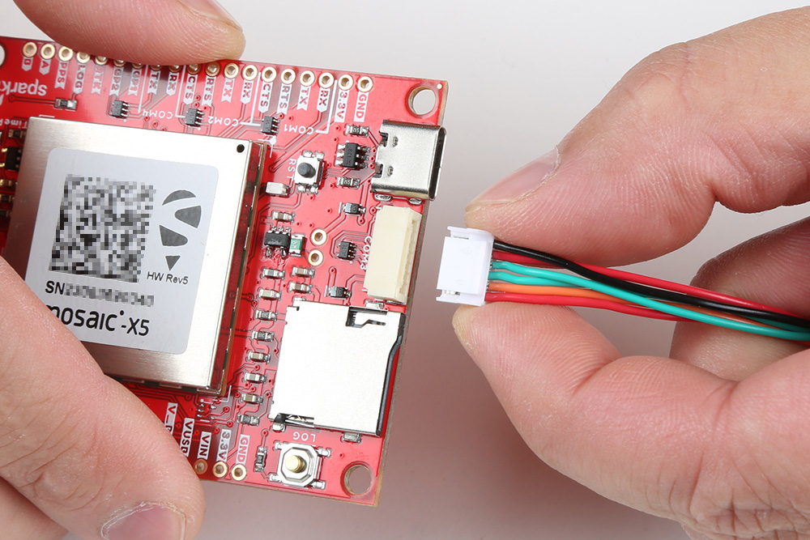{ width="400" }](./assets/img/hookup_guide/assembly-jst_connector.jpg "Click to enlarge")
<figcaption markdown>Connecting a cable to the JST connector of the Tri-band GNSS RTK breakout board.</figcaption>
</figure>

!!! tip "Connecting a Radio"
	### Radio Transceivers
	In most circumstances, users will utilize the JST connector to interface with one of our radio transceivers for RTK correction data:

	

	-   <a href="https://www.sparkfun.com/products/19032">
		<figure markdown>
		
		</figure>

		---

		**SiK Telemetry Radio V3 - 915MHz, 100mW** 
		WRL-19032</a>

	-   <a href="https://www.sparkfun.com/products/20029">
		<figure markdown>
		
		</figure>

		---

		**SparkFun LoRaSerial Kit - 915MHz (Enclosed)** 
		WRL-20029</a>

	

	??? warning "Pin Connections"
		When connecting the Tri-band GNSS RTK breakout board to one of our radio transceivers, users need to be aware of the pin connections between the products; as their pin layout is mirrored on each connector. Although the labels on each device may vary, their pins will operate exactly the same; with the exception of the input voltage ranges.

		

		<table border="1" markdown>
		<tr>
		<th style="vertical-align:middle;">Pin Number</th>
		<td align="center">
			**1** 
			*(Left Side)*
		</td>
		<td align="center">**2**</td>
		<td align="center">**3**</td>
		<td align="center">**4**</td>
		<td align="center">**5**</td>
		<td align="center">
			**6** 
			*(Right)*
		</td>
		</tr>
		<tr>
		<th style="vertical-align:middle;">Label</th>
		<td>
			V - Triband 
			5V - Radios
		</td>
		<td>
			RX - Triband/SiK 
			RXI - LoRaSerial
		</td>
		<td>
			TX - Triband/SiK 
			TXO - LoRaSerial
		</td>
		<td>
			C - Triband 
			CTS - Radios
		</td>
		<td>
			R - Triband 
			RTS - Radios
		</td>
		<td>
			G - Triband 
			GND - Radios
		</td>
		</tr>
		<tr>
		<th style="vertical-align:middle;">Function</th>
		<td>
			**Voltage Input** 
			- Triband: 3.5 to 5.5V 
			- SiK: 5V 
			- LoRaSerial: 3.3 to 5V
		</td>
		<td align="center" style="vertical-align:middle;">UART - Receive</td>
		<td align="center" style="vertical-align:middle;">UART - Transmit</td>
		<td align="center" style="vertical-align:middle;">
			Flow Control 
			*Clear-to-Send*
		</td>
		<td align="center" style="vertical-align:middle;">
			Flow Control 
			*Ready-to-Send*
		</td>
		<td align="center" style="vertical-align:middle;">Ground</td>
		</tr>
		</table>

		

		<!-- Markdown Table (Original)
		| Pin Number | Label              | Function                        |
		| :--------: | :----------------: | :------------------------------ |
		| 1 | V - Triband 5V - Radios  | **Voltage Input** - Triband: 3.5 to 5.5V - SiK: 5V - LoRaSerial: 3.3 to 5V |
		| 2 | RX - Triband/SiK  RXI - LoRaSerial | UART - Receive        |
		| 3 | TX - Triband/SiK  TXO - LoRaSerial | UART - Transmit       |
		| 4 | C - Triband CTS - Radios | Flow Control *Clear-to-Send* |
		| 5 | R - Triband RTS - Radios | Flow Control *Ready-to-Send* |
		| 6 | G - Triband GND - Radios | Ground                          |-->

		#### Pin Connections

		

		-   When connecting the Tri-band GNSS RTK breakout board to either of the radios, the pin connections should follow the table below. If the flow control is not enabled, the only the `RX`, `TX`, and `GND` pins are utilized.

			

			<table markdown>
			<tr>
			<th>Triband</th>
			<td align="center">RX</td>
			<td align="center">TX</td>
			<td align="center">RTS</td>
			<td align="center">CTS</td>
			<td align="center">GND</td>
			</tr>
			<tr>
			<th>Radio</th>
			<td align="center">TX</td>
			<td align="center">RX</td>
			<td align="center">CTS</td>
			<td align="center">RTS</td>
			<td align="center">GND</td>
			</tr>
			</table>

			

		-   As documented in the [LoRaSerial product manual](https://docs.sparkfun.com/SparkFun_LoRaSerial), the pin connections between a host system *(i.e. Tri-band GNSS RTK breakout board)* and the LoRaSerial Kit radio is outlined in the image below.
 
			<figure markdown>
			[{ width="400" }](https://docs.sparkfun.com/SparkFun_LoRaSerial/img/SAMD21%20Flow%20control.png "Click to enlarge")
			<figcaption markdown>The `COM` ports on the Tri-band GNSS RTK breakout board.</figcaption>
			</figure>

		

		#### Wiring Connections
		Users have several options for wiring up these two products. Without creating a custom cable assembly, we recommend utilizing our [breadboard cable](https://www.sparkfun.com/products/23353) along with any [breadboard](https://www.sparkfun.com/categories/302) or [F/F jumper wires](https://www.sparkfun.com/products/8430).

		

	
		-   <a href="https://www.sparkfun.com/products/23353">
			<figure markdown>
			
			</figure>
	
			---
	
			**Breadboard to JST-GHR-06V Cable - 6-Pin x 1.25mm Pitch (For LoRaSerial)** 
			CAB-23353</a>
	
		-   <a href="https://www.sparkfun.com/products/12043">
			<figure markdown>
			
			</figure>
	
			---
	
			**Breadboard - Mini Modular (White)** 
			PRT-12043</a>
	
		

		Following the pin connections, outlined in the [table above](#pin-connections), users can wire up the two devices. In the figures below, a reference diagram for the pin connections of JST connector are provided along with an example setup, using a breadboard. However, users are free to utilize the products/methods that suit their project requirements.

		

		-   Below if a diagram of the pin connections for the 6-pin JST GH connector on the devices that users can reference without having to pull up the datasheet or product manuals.

			<figure markdown>
			[{ width="400" }](./assets/img/hookup_guide/jst_pinout.png "Click to enlarge")
			<figcaption markdown>The pin connections of the JST connector on the Tri-band GNSS RTK breakout board.</figcaption>
			</figure>

			!!! warning
				Please remember that the power pin, is a voltage input and should not be utilized to transfer power between the devices. Users should power their devices separately through the USB connectors on the devices.

		-   Below, is an example illustrating the [Tri-band GNSS RTK breakout board](https://www.sparkfun.com/products/23088) being connected to the [LoRaSerial Kit - 915MHz](https://www.sparkfun.com/products/20029) utilizing the [breadboard cable](https://www.sparkfun.com/products/23353) and [breadboard](https://www.sparkfun.com/products/12002).

			<figure markdown>
			[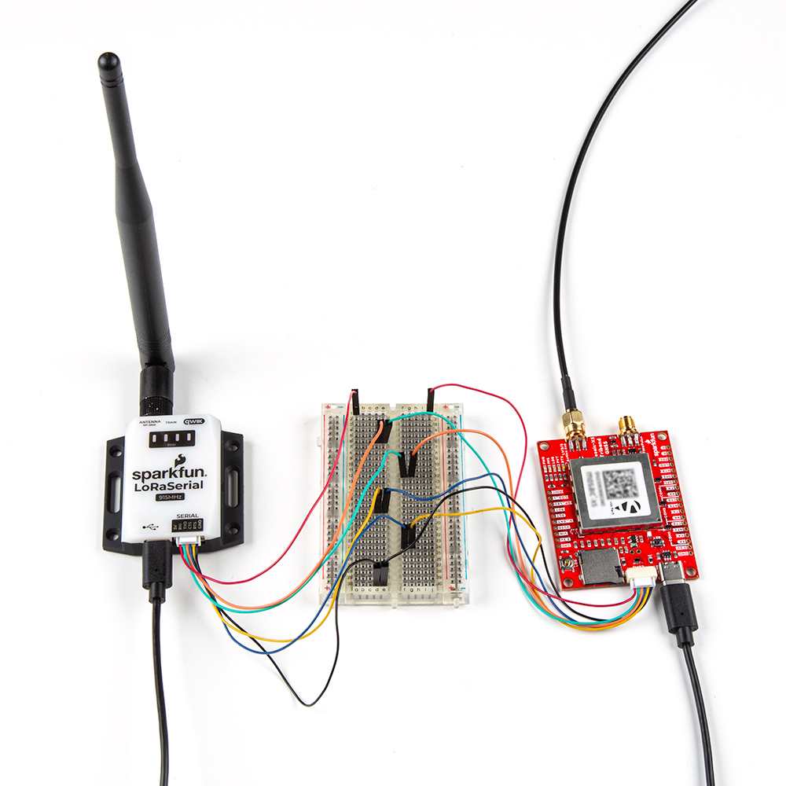{ width="400" }](./assets/img/hookup_guide/assembly-breadboard-radio.jpg "Click to enlarge")
			<figcaption markdown>The [Tri-band GNSS RTK breakout](https://www.sparkfun.com/products/23088) being connected to the [LoRaSerial Kit - 915MHz](https://www.sparkfun.com/products/20029).</figcaption>
			</figure>

			In this example, the devices are being powered separately through their USB ports. This is because the devices power pins are configured as voltage inputs. *(Click the image to enlarge, users will notice that the power pins are not connected together, unlike the other pins.)*

		

		When complete, the setup should appear similar to the figure below.

		??? tip "Pairing Radios"
			By default, the radios in the LoRaSerial Kit - 915MHz are pre-configured for [point-to-point](https://docs.sparkfun.com/SparkFun_LoRaSerial/operating_modes/#point-to-point) communication and a paired with each other. *For instructions on other configurations, please reference the [product manual](https://docs.sparkfun.com/SparkFun_LoRaSerial/) for the LoRaSerial Kit.*

		<figure markdown>
		[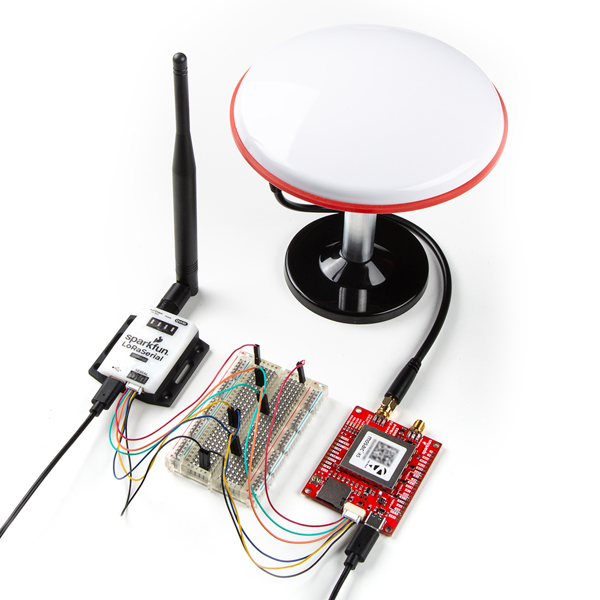{ width="400" }](./assets/img/hookup_guide/assembly-breadboard-radio_setup.jpg "Click to enlarge")
		<figcaption markdown>The [Tri-band GNSS RTK breakout](https://www.sparkfun.com/products/23088) being connected to the [LoRaSerial Kit - 915MHz](https://www.sparkfun.com/products/20029).</figcaption>
		</figure>

		??? info "Custom Crossover Cable"
			Users could potentially create their own custom cable from our existing cable assembly. However, this would require delicate dexterity skills as the plastic pins of the harness's connector easily break. Two cable assemblies are required to create a single custom wiring harness *(i.e. crossover cable)*.

			

			-   <a href="https://www.sparkfun.com/products/17239">
				<figure markdown>
				
				</figure>

				---

				**JST-GHR-04V to JST-GHR-06V Cable - 1.25mm pitch** 
				CAB-17239</a>

			

			Following the pin connections, outlined in the [table above](#pin-connections), users would rewire the cable assembly. Make sure not to exclude the power pin connection; on both devices, that pin is for an input voltage on the JST connector.

			

			

			<figure markdown>
			[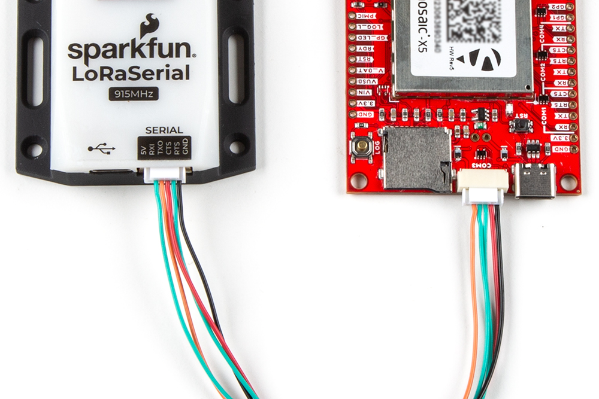{ width="400" }](./assets/img/hookup_guide/assembly-jst-uart.jpg "Click to enlarge")
			<figcaption markdown>A custom cable assembly connecting the [Tri-band GNSS RTK breakout](https://www.sparkfun.com/products/23088) to the [LoRaSerial Kit](https://www.sparkfun.com/products/20029). Notice how the color of the wire swap for the UART and flow control pins between the two connectors (Click to enlarge).</figcaption>
			</figure>

			

			

			<figure markdown>
			[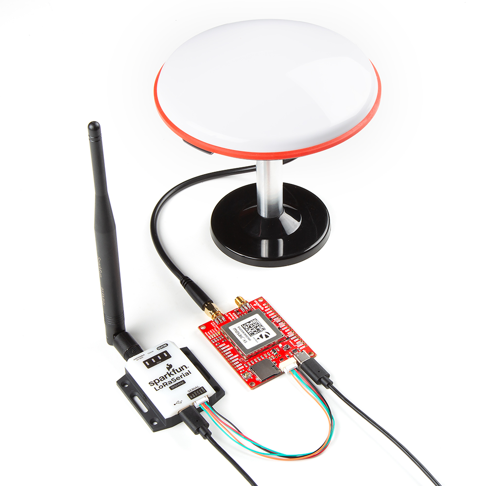{ width="400" }](./assets/img/hookup_guide/assembly-jst-radio_setup.jpg "Click to enlarge")
			<figcaption markdown>The same IC-hook modification. The setup is viewed from a different angle w/ the GPS antenna inside the picture frame.</figcaption>
			</figure>

			

			

	??? danger "Enabling a Voltage Output"
		!!! warning "Disclaimer"
			**Due to the inherent risks of the modifications below, technical assistance will not be provided nor will refunds or returns be authorized for products with the following modifications.**

			By proceeding with the instructions below, users acknowledge that they are purposefully circumventing the reverse current protection diode on the board. By doing so, this can potentially expose their computer and any other devices to be permanently damaged. ***Proceed at your own risk!***

		#### Enable Voltage Output
		While not recommended, because it bypasses the reverse current protection diode, users can enable a voltage output on the JST connector of the Tri-band GNSS RTK breakout board. Below are two different modifications that users could potentially utilize.

		##### Jumper Pin Modification
		The jumper pin modification requires a [header](https://www.sparkfun.com/categories/381) to be soldered to the `VIN` and `VUSB` pins of the Tri-band GNSS RTK breakout board. Then a [2-pin jumper](https://www.sparkfun.com/products/9044) is utilized to bypass the protection diodes between the two pins. The example in the image below, utilizes a simple straight header. When a jumper is placed on the `VIN` and `VUSB` pins, any power that is provided through the USB-C connector of the Tri-band GNSS RTK breakout, will now be connected to the the power pin of the JST connector.

		

		

		<figure markdown>
		[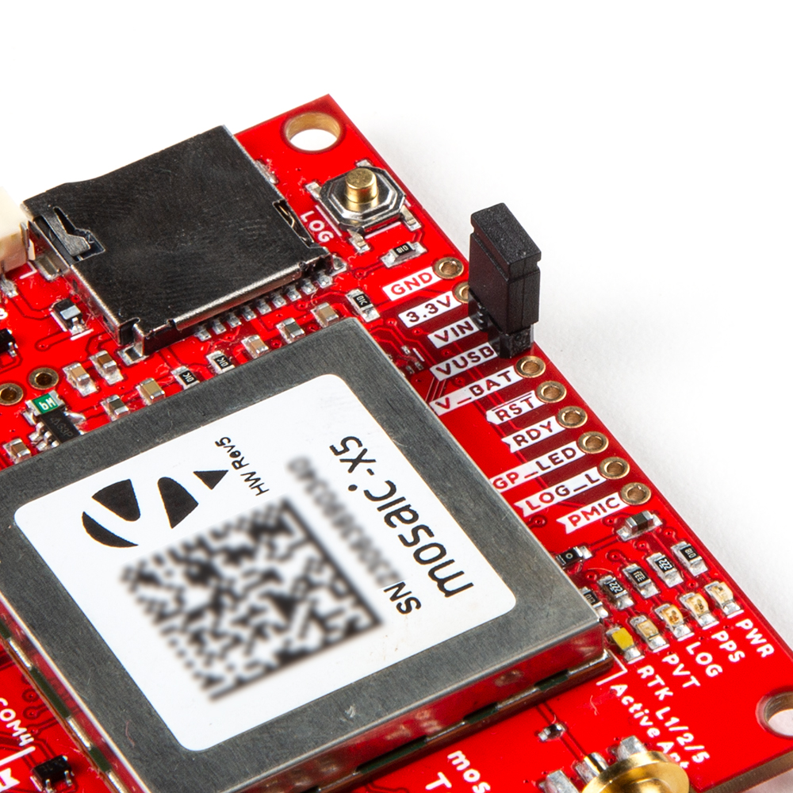{ width="240" }](./assets/img/hookup_guide/assembly-jumper.jpg "Click to enlarge")
		<figcaption markdown>The jumper pin modification that enables a voltage output on the power pin of the JST connector on the Tri-band GNSS RTK breakout board.</figcaption>
		</figure>

		

		

		-   <a href="https://www.sparkfun.com/products/116">
			<figure markdown>
			
			</figure>
	
			---
	
			**Break Away Headers - Straight** 
			PRT-00116</a>

		

		

		-   <a href="https://www.sparkfun.com/products/9044">
			<figure markdown>
			
			</figure>
	
			---
	
			**Jumper - 2 Pin** 
			PRT-09044</a>

		

		

		##### IC-Hook Modification
		The IC-hook modification utilizes an [IC-hook w/ pigtail](https://www.sparkfun.com/products/9741) to breakout the `VUSB` pin of the Tri-band GNSS RTK breakout board on a jumper wire.

		

		

		-   <a href="https://www.sparkfun.com/products/9741">
			<figure markdown>
			
			</figure>
	
			---
	
			**IC Hook with Pigtail** 
			CAB-09741</a>

		

		

		<figure markdown>
		[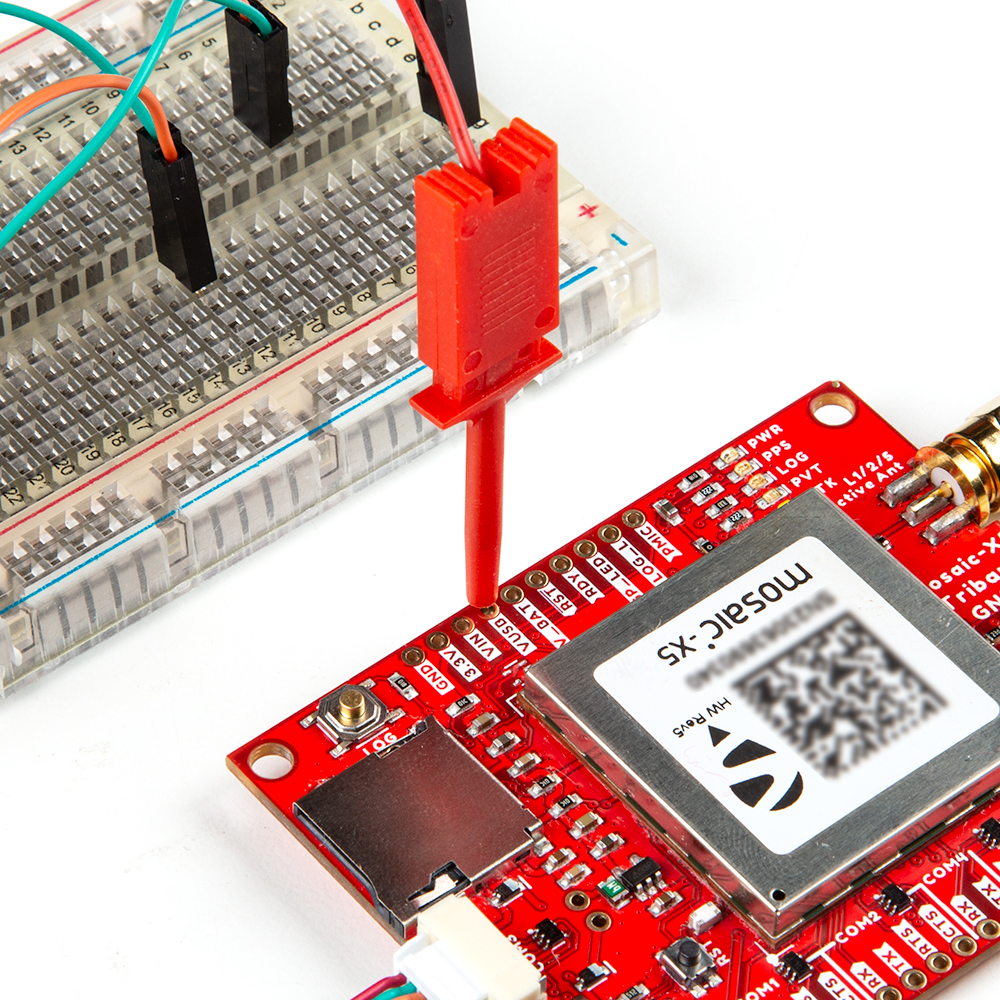{ width="240" }](./assets/img/hookup_guide/assembly-ic_hook.jpg "Click to enlarge")
		<figcaption markdown>The IC-hook modification that provides a voltage output from the `VUSB` pin of the Tri-band GNSS RTK breakout board.</figcaption>
		</figure>

		

		

		In the example displayed below, IC-hook w/ pigtail connects the `VUSB` pin of the Tri-band GNSS RTK breakout directly to the `5V` pin of the LoRaSerial Kit through the breadboard. *(Click the images to enlarge, users will notice that the power pin of the radio is wired directly to the `VUSB` pin of the Tri-band GNSS RTK breakout board.)*

		

		

		<figure markdown>
		[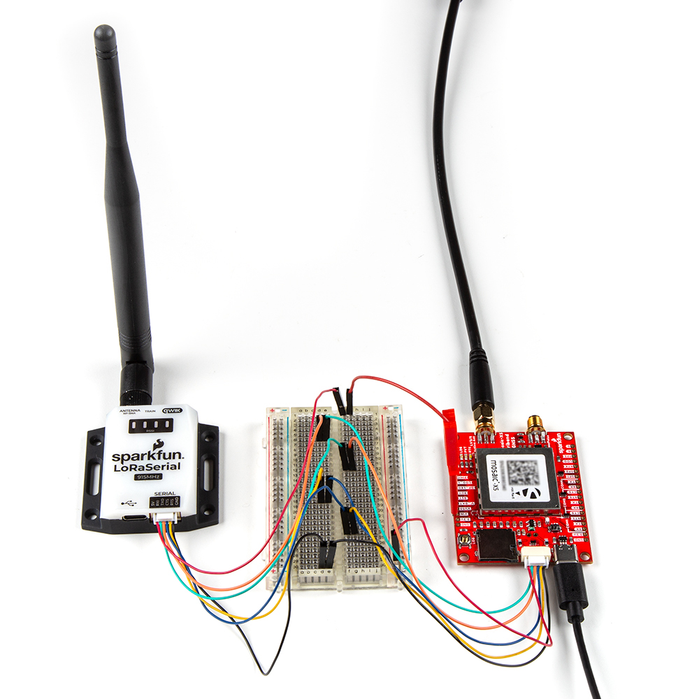{ width="400" }](./assets/img/hookup_guide/assembly-breadboard-radio-ic_hook.jpg "Click to enlarge")
		<figcaption markdown>The IC-hook modification that provides a voltage output from the `VUSB` pin of the Tri-band GNSS RTK breakout board.</figcaption>
		</figure>

		

		

		<figure markdown>
		[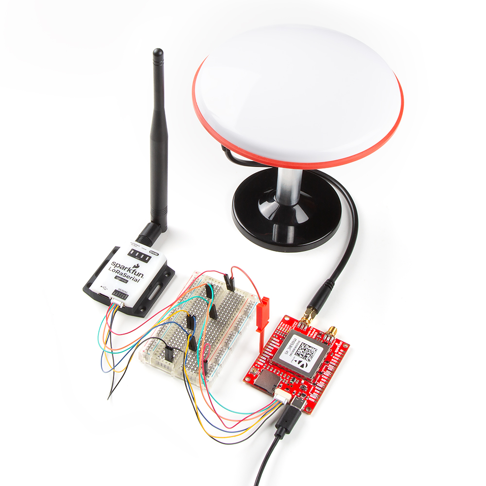{ width="400" }](./assets/img/hookup_guide/assembly-breadboard-radio_setup-ic_hook.jpg "Click to enlarge")
		<figcaption markdown>The same IC-hook modification. The setup is viewed from a different angle w/ the GPS antenna inside the picture frame.</figcaption>
		</figure>

		

		

<!-- !!! tip "Connecting to a PixHawk4"
	The Septentrio mosaic-X5 GNSS receiver module, is supported on the PixHawk4 
	https://www.septentrio.com/en/company/news/septentrio-gps/gnss-now-supports-px4-autopilot
	https://customersupport.septentrio.com/s/article/How-to-connect-mosaic-go-with-PX4-autopilot
	https://github.com/septentrio-gnss/Septentrio-PX4-Autopilot
	https://docs.px4.io/main/en/gps_compass/septentrio_mosaic-go.html

	https://customersupport.septentrio.com/s/article/How-to-connect-latest-AsteRx-OEM-receivers-with-Pixhawk-4-using-Robotics-Interface-board
 -->

## Breakout Pins
The [PTH](https://en.wikipedia.org/wiki/Through-hole_technology "Plated Through Holes") pins on the Tri-band GNSS RTK board are broken out into 0.1"-spaced pins on the outer edges of the board.

??? note "New to soldering?"
	If you have never soldered before or need a quick refresher, check out our [How to Solder: Through-Hole Soldering](https://learn.sparkfun.com/tutorials/how-to-solder-through-hole-soldering) guide.

	

	-   <a href="https://learn.sparkfun.com/tutorials/5">
		<figure markdown>
		
		</figure>

		---
		
		**How to Solder: Through-Hole Soldering**</a>

	

=== "Headers"

	When selecting headers, be sure you are aware of the functionality you require.

	<figure markdown>
	[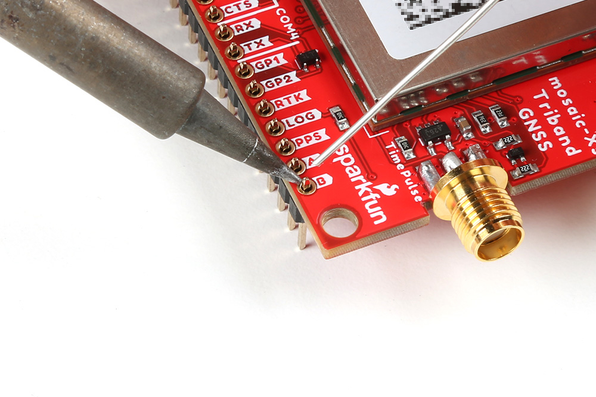{ width="400" }](./assets/img/hookup_guide/assembly-headers.jpg "Click to enlarge")
	<figcaption markdown>Soldering headers to the Tri-band GNSS RTK breakout board.</figcaption>
	</figure>

=== "Hookup Wires"

	For a more permanent connection, users can solder wires directly to the board.

	<figure markdown>
	[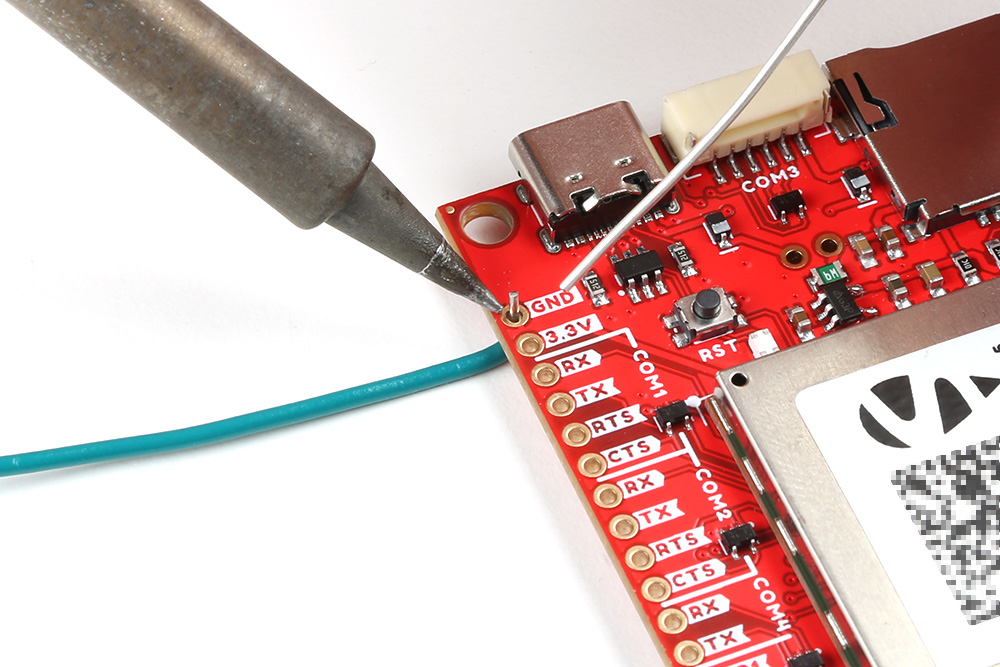{ width="400" }](./assets/img/hookup_guide/assembly-wires.jpg "Click to enlarge")
	<figcaption markdown>Soldering wires to the Tri-band GNSS RTK breakout board.</figcaption>
	</figure>

