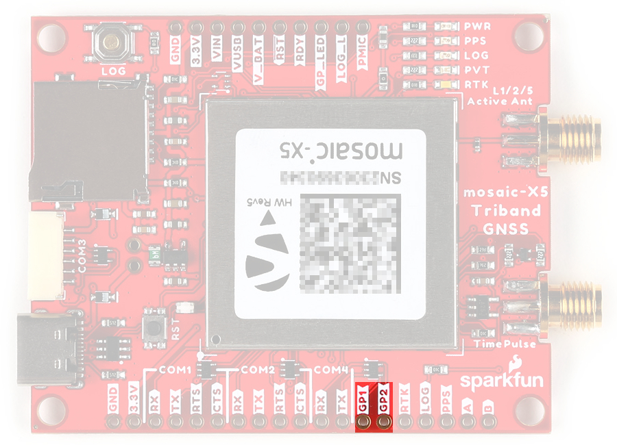
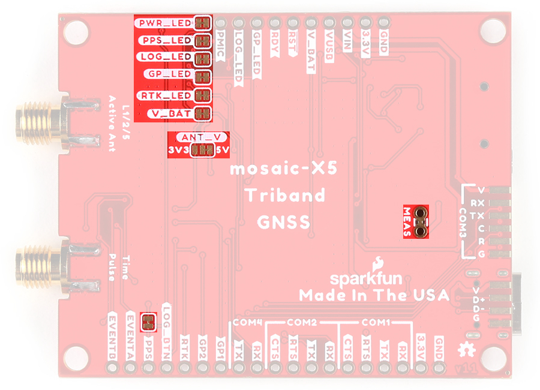

!!! danger "Important: Read Before Use!"
	!!! warning "ESD Sensitivity"
		The mosaic-X5 module is sensitive to [ESD](https://en.wikipedia.org/wiki/Electrostatic_discharge "Electrostatic Discharge"). Use a proper grounding system to make sure that the working surface and the components are at the same electric potential.

		??? info "ESD Precaution"
			As recommended by the manufacturer, we highly recommend that users take the necessary precautions to avoid damaging their module.

			- The Tri-band GNSS RTK breakout board features ESD protection on the USB-C connector and breakout's I/O:
				- USB data lines
				- I/O PTH pads
				- JST connector's pins
			- The mosaic-X5 module features internal ESD protection to the `ANT_1` antenna input.

			

			

			

			<article class="video-500px">
			<iframe src="https://www.youtube.com/embed/hrL5J6Q5gX8?si=jOPBat8rzMnL7Uz4&amp;start=26;&amp;end=35;" title="Septentrio: Getting Started Video (playback starts at ESD warning)" frameborder="0" allow="accelerometer; autoplay; clipboard-write; encrypted-media; gyroscope; picture-in-picture" allowfullscreen></iframe>
			</article>
			

			

			-   <a href="https://www.sparkfun.com/products/25572">
				<figure markdown>
				
				</figure>		

				---

				**iFixit Anti-Static Wrist Strap** 
				TOL-25572</a>

			

	!!! warning "Active Antenna"
		Never inject an external DC voltage into the SMA connector for the GPS antenna, as it may damage the mosaic-X5 module. For instance, when using a splitter to distribute the antenna signal to several GNSS receivers, make sure that no more than one output of the splitter passes DC. Use [DC-blocks](https://en.wikipedia.org/wiki/DC_block) otherwise.

		??? info
			A 3 - 5.5V DC voltage can be applied to the main antenna from the `VANT` pin, obviating the need for an external antenna supply or [bias-tee](https://en.wikipedia.org/wiki/Bias_tee).

## Board Dimensions
The board dimensions are illustrated in the drawing below; the listed measurements are in inches.

<figure markdown>
[{ width="400" }](./assets/img/hookup_guide/dimensions.png "Click to enlarge")
<figcaption markdown>
[Board dimensions (PDF)](./assets/board_files/dimensions.pdf) for the Tri-band GNSS RTK breakout board, in inches.
</figcaption>
</figure>

??? tip "Need more measurements?"
	For more information about the board's dimensions, users can download the [eagle files](./assets/board_files/eagle_files.zip) for the board. These files can be opened in Eagle and additional measurements can be made with the dimensions tool.

	??? info ":octicons-download-16:{ .heart } Eagle - Free Download!"
		Eagle is a [CAD]("computer-aided design") program for electronics that is free to use for hobbyists and students. However, it does require an account registration to utilize the software.

		

		[Download from :autodesk-primary:{ .autodesk }](https://www.autodesk.com/products/eagle/free-download "Go to downloads page"){ .md-button .md-button--primary width="250px" }
		

	
	??? info ":straight_ruler: Dimensions Tool"
		This video from Autodesk demonstrates how to utilize the dimensions tool in Eagle, to include additional measurements:

		

		

		<iframe src="https://www.youtube.com/embed/dZLNd1FtNB8" title="EAGLE Dimension Tool" frameborder="0" allow="accelerometer; autoplay; clipboard-write; encrypted-media; gyroscope; picture-in-picture" allowfullscreen></iframe>
		

		{ .qr }
		

## USB-C Connector
The USB connector is provided to power and interface with the mosaic-X5 GNSS receiver. For most users, it will be the primary method for communicating with the mosaic-X5 module.

<figure markdown>
[{ width="400" }](./assets/img/hookup_guide/usb_connector.jpg "Click to enlarge")
<figcaption markdown>USB-C connector on the Tri-band GNSS RTK breakout board.</figcaption>
</figure>

## Power
The Tri-band GNSS RTK breakout board only requires **5V** to power all of the board's components. The simplest method to power the board is through the USB-C connector. Alternatively, the board can be converted to utilize **3.3V** for low power applications.

<figure markdown>
[{ width="400" }](./assets/img/hookup_guide/power_connections.jpg "Click to enlarge")
<figcaption markdown>Tri-band GNSS RTK breakout board's power connections.</figcaption>
</figure>

Below, is a general summary of the power circuitry on the board, broken out as [PTH](https://en.wikipedia.org/wiki/Through-hole_technology "Plated Through Holes") pins:

* **`VUSB`** - The voltage from the USB-C connector, usually **5V**.
	* Input Voltage Range: 4.4 - 5.5 V
	* Power source for the entire board.
		* Powers the 3.3V voltage regulator (AP2112) and the active antenna preamplifier for the mosaic-X5 module. (1)
		* This pin powers the integrated PHY of the mosaic-X5 module's USB interface.
	* Features ESD protection	and a thermal fuse.
* **`VIN`** - Alternate input supply voltage for the board.
	* Alternative power supply input for the board, excluding the integrated PHY of the USB interface.
	* Power source for the entire board.
		* Powers the 3.3V voltage regulator (AP2112) and the active antenna preamplifier for the mosaic-X5 module. (2)
	* Features a thermal fuse.
* **`3.3V`** - Provides a regulated 3.3V from [AP2112](./assets/component_documentation/AP2112.pdf) using the power from the `VIN` or `VUSB` (5V) inputs.
	* Input Voltage Range: 3.135 - 3.465 V
	* The **3.3V** AP2112 LDO regulator can source up to 600mA.
		* Used to power the mosaic-X5 module, SD card slot, and the power LED.
		* The active antenna preamplifier (3) for the mosaic-X5 module can be alternatively powered with 3.3V *(see the **[Jumpers](#jumpers)** and **[mosaic-X5](#mosaic-X5)** sections)*.
* **`V_BATT`** - *Always-on* power supply
	* Input Voltage Range: 3.135 - 3.465 V
	* Tied to `3.3V` *(see the **[Jumpers](#jumpers)** section)*.
		* Used to power the module in **Standby** mode.
* **`GND`** - The common ground or the 0V reference for the voltage supplies.

1. * While the [AP2112](./assets/component_documentation/AP2112.pdf) LDO regulator has an input voltage range of 2.5 - 6V, a minimum supply voltage of **3.5V** is recommended for a 3.3V output.
	* A 3 - 5.5V DC voltage can be applied to the main antenna from the `VANT` pin, obviating the need for an external antenna supply or [bias-tee](https://en.wikipedia.org/wiki/Bias_tee).
2. * While the [AP2112](./assets/component_documentation/AP2112.pdf) LDO regulator has an input voltage range of 2.5 - 6V, users should supply:

		* A minimum of **3.5V** for a 3.3V output from the regulator
		* A maximum of **5.5V** as not to exceed the electrical limitations of the mosaic-X5 module

	* A 3 - 5.5V DC voltage can be applied to the main antenna from the `VANT` pin, obviating the need for an external antenna supply or [bias-tee](https://en.wikipedia.org/wiki/Bias_tee).

3. A 3 - 5.5V DC voltage can be applied to the main antenna from the `VANT` pin, obviating the need for an external antenna supply or [bias-tee](https://en.wikipedia.org/wiki/Bias_tee).

??? tip "`VIN` Input Voltage"
	While the [AP2112](./assets/component_documentation/AP2112.pdf) LDO regulator has an input voltage range of 2.5 - 6V, users should supply:

	* A minimum of **3.5V** for a 3.3V output from the regulator
	* A maximum of **5.5V** as not to exceed the electrical limitations of the mosaic-X5 module

	However, users are able to bypass the electrical limitations of the mosaic-X5 module and power the board with up to 6V. Users just need to modify the `ANT_V` jumper *(see the **[Jumpers](#jumpers)** section)* to the `3V3` pad.

??? tip "`MEAS` Pins"
	These pins can be used to measure the current being drawn through the USB connector or `VUSB`/`VIN` pins *(see the **[Jumpers](#jumpers)** section)*.

??? tip "JST Connector"
	The `V` pin of the JST connector is designed for an input voltage to `VIN`. By default, it does not operate as a voltage output.
	
	!!! warning "Bypass - Reverse Current Protection Diode"
		!!! danger "Danger - Proceed at Your Own Risk!"
			By bypassing the reverse current protection diode, users should take precautions to ensure that they do not provide an input voltage to the JST connector, when the board is connected to their computer. Otherwise, it may result in damage to the computer's USB bus.

		To enable an output voltage on the JST connector, users will need to bypass the protection diode that prevents reverse current to the USB-C connector. This can be done by jumping the `VUSB` and `VIN` pins together.

		Once jumpered, when the board is powered through the USB-C connector, the `V` pin of the JST connector will provide an output voltage from the USB-C connector.

!!! info
	For more details, users can reference the [schematic](./assets/board_files/schematic.pdf) and the datasheets of the individual components on the board.

### Power Modes
The mosaic-X5 module operates in three different power states.

* Off - The module is completely turned off
	* When transitioning to the **Off** state from **Active**, recent data may not be lost and not logged to the external SD card
* Standby - The module is in a low-power consumption mode (1)
	* The module power consumption in standby is <5mW
	* The `PMIC_ON_REQ` pin is driven `LOW`
	* The `MODULE_RDY` pin is in a `LOW`
	* Monitors the state of the `ONOFF` pin *(Not available)*
* Active - The module is operating with all functions active
	* On power up, the module restarts in the configuration stored in the boot configuration file
	* The `PMIC_ON_REQ` pin is driven `HIGH`
	* The `MODULE_RDY` pin is in a `HIGH` (2)

1. Essentially, the same state as **Off**; except in the transition to the **Standby** mode, before the module shuts down:
	* All logging tasks are terminated
	* The SD card is unmounted
	* The `PMIC_ON_REQ` pin is driven `LOW`
1. Level becomes `HIGH` about 300ms after powering up, reset, or waking up from standby

!!! info
	By default, the board is hardwired to operate only in the **Active** and **Off** modes.

	*For more information on the power management of the mosaic-X5 module, please refer to sections **3.4**, **3.5**, **4.1**, and **4.13** of the [hardware manual](./assets/component_documentation/mosaic_hardware_manual_v1.8.0.pdf).*

??? Tip "Enabling **Standby** Mode"
	Users can enable **Standby** mode on the mosaic-X5, by modifying the `V_BATT` jumper *(see the **[Jumpers](#jumpers)** section)* and providing an external power source for the `V_BATT` pin *(3.3V)*. However, because the `ONOFF` pin isn't exposed users will need to power cycle the board to return to the **Active** state.

??? tip "Drive Current - `PMIC_ON_REQ`/`MODULE_RDY`"
	The drive current on the `PMIC_ON_REQ` and `MODULE_RDY` pins is low. Enough to be read by a digital pin on a microcontroller, but not high enough to drive an LED.

### Power Consumption
The power consumption of the mosaic-X5 module depends on the GNSS signals enabled and the positioning mode. The table below, lists the average power consumption for common configurations. The current listed, is based on a supply voltage of 3.3V.

| GNSS Signals | Positioning Mode | Power (mW) | Current (mA) |
| :----------- | :--------------- | :--------: | :----------: |
| GPS L1 C/A | Stand-Alone (1Hz) | 550 | 167 |
| GPS L1/L2 | RTK (1Hz) | 670 | 203 |
| GPS/GLONASS L1/L2 | RTK (1Hz) | 695 | 211 |
| GPS/GLONASS L1/L2+GALILEO L1/E5a +BeiDou B1C/B2a | RTK (1Hz) | 850 | 258 |
| GPS/GLONASS L1/L2+GALILEO L1/E5a +BeiDou B1C/B2a | RTK (100 Hz) | 930 | 282 |
| GPS/GLONASS L1/L2 + L-band | PPP (1Hz) | 760 | 230 |
| All signals from all GNSS constellations | Static (1Hz) | 910 | 276 |
| All signals from all GNSS constellations +L-band | Static(1Hz) | 980 | 297 |
| All signals from all GNSS constellations +L-band | Static (100Hz) | 1080 | 327 |

*Source: [mosaic-X5 Hardware Manual](./assets/component_documentation/mosaic_hardware_manual_v1.8.0.pdf)*

## :fontawesome-solid-microchip:&nbsp; mosaic-X5
The centerpiece of the Tri-band GNSS RTK breakout board, is the [mosaic-X5 module](./assets/component_documentation/mosaic_hardware_manual_v1.8.0.pdf) from [Septentrio](https://www.septentrio.com/en). Their mosaic modules are low-power, multi-band, multi-constellation GNSS receivers capable of delivering centimeter-level precision at high update rates. The modules also feature Septentrio's unique [AIM+ technology](https://www.septentrio.com/en/learn-more/advanced-positioning-technology/aim-resilient-and-secure-gnss/gps-receivers) for interference mitigation and anti-spoofing, which ensures their best-in-class reliability and scalable position accuracy.

<article class="video-500px">
<iframe src="https://www.youtube.com/embed/Co8hrVeklAA" title="Septentrio: Mosaic - GNSS / GPS module receiver range" frameborder="0" allow="accelerometer; autoplay; clipboard-write; encrypted-media; gyroscope; picture-in-picture" allowfullscreen></iframe>
</article>

-   <figure markdown>
	[{ width="400" }](./assets/img/hookup_guide/mosaic-X5.jpg "Click to enlarge")
	<figcaption markdown>The mosaic-X5 module on the Tri-band GNSS RTK breakout board.</figcaption>
	</figure>

**Features:**

* Operating Voltage: **3.135 - 3.465V**
* Operating Temperature: -40 - 85&deg;C
* GNSS Support
	* GPS: L1C/A, L1PY, L2C, L2P, L5
	* GLONASS: L1CA, L2CA, L2P, L3 CDMA
	* Beidou: B1I, B1C, B2a, B2b, B2I, B3
	* Galileo: E1, E5a, E5b, E5 AltBoc, E6
	* QZSS: L1C/A, L1 C/B, L2C, L5
	* Navic: L5
	* SBAS: Egnos, WA
* Antenna Specifications
	* Preamplification Range: 15-50dB
	* Bias Voltage: 3.0 - 5.5V
	* 448 Hardware Channels
* Update Rate: 100Hz
* Latency: < 10ms

 

* Time to Fix
	* Cold Start: < 45s
	* Warm: < 20s
	* Reacquisition: 1s
* Timing Precision: 5ns
* Position Accuracy

	

	| Correction | Horizontal                             | Vertical                     |
	| :--------- | :------------------------------------: | :--------------------------: |
	| RTK        | **0.6cm** *(&plusmn;0.5ppm)* ~0.25" | 1cm *(&plusmn;1ppm)* ~.4" |
	| DGNSS      | 40cm ~1.3'                          | 70cm ~2.3'                |
	| SBAS       | 60cm ~2'                            | 80cm ~2.6'                |
	| Standalone | 1.2m ~4'                            | 1.9m ~6.2'                |

	

!!! info
	The mosaic-X5 has three power modes: **Active**, **Standby**, and **Off** *(see the **[Power Modes](#power-modes)** section)*.

### Frequency Bands
The mosaic modules are multi-band, multi-constellation GNSS receivers. Below, are charts illustrating the frequency bands utilized by all the global navigation satellite systems and the ones supported by the mosaic-X5 module.

<figure markdown>
[{ width="650" }](./assets/img/hookup_guide/frequency_bands.png "Click to enlarge")
<figcaption markdown>The frequency bands supported by the mosaic-X5 GNSS receiver.</figcaption>
</figure>

<figure markdown>
[{ width="800" }](https://www.tallysman.com/app/uploads/2021/07/Tallysman-GNSS-Frequencies-v8.0_Chart-1-1024x425.png "Click to enlarge")
<figcaption markdown>Frequency bands of the global navigation satellite systems. (Source: [Tallysman](https://www.tallysman.com/gnss-constellations-radio-frequencies-and-signals/))</figcaption>
</figure>

!!! info
	For a comparison of the frequency bands supported by the mosaic modules, refer to section **3.1** of the [hardware manual](./assets/component_documentation/mosaic_hardware_manual_v1.8.0.pdf).

	??? info "What are Frequency Bands?"
		A [frequency band](https://en.wikipedia.org/wiki/Frequency_band) is a section of the [electromagnetic spectrum](https://en.wikipedia.org/wiki/Electromagnetic_spectrum), usually denoted by the range of its upper and lower limits. In the [radio spectrum](https://en.wikipedia.org/wiki/Radio_spectrum), these frequency bands are usually regulated by region, often through a government entity. This regulation prevents the interference of RF communication; and often includes major penalties for any interference with critical infrastructure systems and emergency services.

		<figure markdown>
		[{ width="400" }](https://gssc.esa.int/navipedia/images/c/cf/GNSS_All_Signals.png "Click to enlarge")
		<figcaption markdown>Frequency bands of the global navigation satellite systems. (Source: [ESA](https://gssc.esa.int/navipedia/index.php?title=File:GNSS_All_Signals.png "European Space Agency"))</figcaption>
		</figure>

		However, if the various GNSS constellations share similar frequency bands, then how do they avoid interfering with one another? Without going too far into detail, the image above illustrates the frequency bands of each system with a few characteristics specific to their signals. Wit these characteristics in mind, along with other factors, the chart can help users to visualize how multiple GNSS constellations might co-exist with each other.

		For more information, users may find these articles of interest:

		* [GNSS signal](https://gssc.esa.int/navipedia/index.php/GNSS_signal)
		* [GPS Signal Plan](https://gssc.esa.int/navipedia/index.php?title=GPS_Signal_Plan)
		* [GLONASS Signal Plan](https://gssc.esa.int/navipedia/index.php?title=GLONASS_Signal_Plan)
		* [GALILEO Signal Plan](https://gssc.esa.int/navipedia/index.php?title=GALILEO_Signal_Plan)

### Position Accuracy

The accuracy of the position reported from the mosaic-X5 module, can be improved based upon the correction method being employed. Currently, [RTK](https://en.wikipedia.org/wiki/Real-time_kinematic_positioning "Real-Time Kinematic") corrections provide the highest level of accuracy; however, users should be aware of certain limitations of the system:

* RTK technique requires real-time correction data from a reference station or network of base stations.
	* RTK corrections are signal specific *(i.e. an RTK network might provide corrections on only `E5b` and not `E5a`)*.
* The range of the base stations will vary based upon the RTK method being employed.
* The reliability of RTK corrections are inherently reduced in [multipath environments](https://en.wikipedia.org/wiki/Multipath_propagation). However, with Septentrio's multipath mitigation technology ([APME+](https://www.septentrio.com/en/learn-more/Advanced-positioning-technology/gnss-technology/multipath-mitigation-technology "A-Posteriori Multipath Estimation")) on the mosaic-X5, these errors are significantly reduced when compared to multipath mitigation techniques that modify the correlators in the tracking channels.

| Correction                                                                                    | Horizontal                             | Vertical                     |
| :-------------------------------------------------------------------------------------------- | :------------------------------------: | :--------------------------: |
| [RTK](https://en.wikipedia.org/wiki/Real-time_kinematic_positioning "Real-Time Kinematic")    | **0.6cm** *(&plusmn;0.5ppm)* ~0.25" | 1cm *(&plusmn;1ppm)* ~.4" |
| [DGNSS](https://en.wikipedia.org/wiki/Differential_GPS "Differential GNSS")                   | 40cm ~1.3'                          | 70cm ~2.3'                |
| [SBAS](https://en.wikipedia.org/wiki/GNSS_augmentation "Satellite-Based Augmentation System") | 60cm ~2'                            | 80cm ~2.6'                |
| Standalone                                                                                    | 1.2m ~4'                            | 1.9m ~6.2'                |

??? info "RTK Corrections"
	To understand how RTK works, users will need a more fundamental understanding of the signal error sources.

	

	-   <a href="https://www.sparkfun.com/news/7533">
		<figure markdown>
		
		</figure>

		---

		**Real-Time Kinematics Explained**</a>

	-   <a href="https://www.sparkfun.com/news/7138">
		<figure markdown>
		
		</figure>

		---

		**What is Correction Data?**</a>

	-   <a href="https://www.septentrio.com/en/learn-more/insights/gnss-corrections-demystified">
		<figure markdown>
		
		</figure>

		---

		**GNSS Corrections Demystified**</a>

	

!!! tip
	For the best performance, we highly recommend that users configure the module to utilize/provide RTK corrections with a compatible L1/L2/L5 (tri-band) GNSS antenna and utilize a low-loss cable.

### Peripherals and I/O Pins
The mosaic-X5 features several peripherals and I/O pins. Some of these are broken out as pins on the Tri-band GNSS RTK breakout board; whereas, others are broken out to their specific interface *(i.e. &micro;SD Carsd slot, USB connector, etc.)*. Additionally, some of their connections are tied to other components on the board.

<figure markdown>
[{ width="400" }](./assets/img/hookup_guide/pins-io3.jpg "Click to enlarge")
<figcaption markdown>The peripherals and I/O pins on the Tri-band GNSS RTK breakout board.</figcaption>
</figure>

<article class="annotate" markdown>
**Interfaces:**

- 4x UART (LVTTL, up to 4 Mbps)
- ~~Ethernet (RMII/MDIO), 10/100 Mbps~~(1)
- USB device (2.0, HS)
- SDIO (mass storage)
- 2x GPIO user programmable
- 2x Event markers
- 1x Configurable PPS out

</article>

1. Not available on the Tri-band GNSS RTK breakout board.

=== "USB"
	For most users, this will be the primary interface for the mosaic-X5 module.

	<figure markdown>
	[{ width="400" }](./assets/img/hookup_guide/usb_connector.jpg "Click to enlarge")
	<figcaption markdown>USB-C connector on the Tri-band GNSS RTK breakout board.</figcaption>
	</figure>

	

	* When a module is initially connected to a computer, the board will initialize as a USB mass storage device.
		* For Windows PCs, the USB driver (1) can be installed from the mass storage device or the RxTools software suite.
		* When the SD card is mounted, this drive will contain the contents of the SD card that is inserted on the board.
	* Once the USB driver is installed:
		* Two virtual `COM` ports are emulated, which can be used as standard `COM` ports to access the receiver.
		* This interface will support Ethernet-over-USB.
			* By default, the receiver is not allowed to access the Internet over USB.
			* The IP address allocated to the Ethernet-over-USB interface is `192.168.3.1`.
				* The IP address cannot be changed; therefore, only single receiver should be connected to your computer at a time.

	

	1. On Linux, the standard Linux CDC-ACM driver is suitable.

=== "UARTs"
	The mosaic-X5 has four UARTs that are organized into separate `COM` ports. The operation for each of these ports can be configured separately.

	<figure markdown>
	[{ width="400" }](./assets/img/hookup_guide/com_ports.jpg "Click to enlarge")
	<figcaption markdown>The `COM` ports on the Tri-band GNSS RTK breakout board.</figcaption>
	</figure>

	

	
	* `COM` ports 1-3 feature flow control pins, which are disabled by default.
	* `COM3` is available through the JST connector(1), but the pins can also be accessed from the pads on the bottom of the board.
	* These ports also support a point-to-point protocol server, by which it can accept TCP/IP connections over a serial link.

	

	1. 

		<a href="https://www.sparkfun.com/products/18079">
		<figure markdown>
		{ width="300" }
		</figure>

		---

		**Breadboard to JST-GHR-06V Cable - 6-Pin x 1.25mm Pitch** 
		CAB-18079</a>

		

	!!! info
		By default, the `COM` ports will be configured with the following settings: 

		* Baudrate: 115200bps
		* Data Bits: 8
		* Parity: No
		* Stop Bits: 1
		* Flow Control: None

	??? tip "Pin Connections"
		When connecting to the board's UART pins, the pins should be connected based upon the flow of their data. For example, when utilizing the [Telemetry Radio](https://www.sparkfun.com/products/19032) or the [LoRaSerial Kit](https://www.sparkfun.com/products/20029):

		<figure markdown>
		[{ width="400" }](https://docs.sparkfun.com/SparkFun_LoRaSerial/img/SAMD21%20Flow%20control.png "Click to enlarge")
		<figcaption markdown>Connection of the UART pins from the [LoRaSerial radio](https://www.sparkfun.com/products/20029) to a host system, like the Tri-band GNSS RTK breakout board.</figcaption>
		</figure>

=== "Antenna"
	Users will need to connect a compatible GPS antenna to the `L1/2/5 ActiveAnt` SMA connector. The type of antenna used with the mosaic-X5 module affects the overall accuracy of the positions calculated by the GNSS receiver.

	* An active antenna often features a [LNA](https://en.wikipedia.org/wiki/Low-noise_amplifier "low-noise amplifier"). This allows the module to boost the signal received by the GNSS module without degrading the [SNR](https://en.wikipedia.org/wiki/Signal-to-noise_ratio Signal-to-noise ratio).
	* The more bands an antenna supports, the greater the performance.
		* Faster acquisition time.
		* Access and support for the `L5` GPS band can potentially mitigate multi-path errors.
		* Supporting more frequency bands, allows a GNSS receiver to be less susceptible to jamming and spoofing.

	!!! tip
		For the best performance, we recommend users choose a compatible L1/L2/L5 (tri-band) GNSS antenna and utilize a low-loss cable.

	There are some key parameters related to an antenna that can make or break the signal reception from the satellites. These include the operation frequency, gain, polarization, efficiency and overall loss.

	<figure markdown>
	[{ width="400" }](./assets/img/hookup_guide/antenna-gps.jpg "Click to enlarge")
	<figcaption markdown>The SMA connector to attach a GPS antenna to the Tri-band GNSS RTK breakout board.</figcaption>
	</figure>

	!!! info
		The `VANT` pin provides external power for an active antenna. By default, this supply voltage is configured at **5V** *(see the **[Jumpers](#jumpers)** section)*.

		!!! danger
			Never inject an external DC voltage into the SMA connector for the GPS antenna, as it may damage the mosaic-X5 module. For instance, when using a splitter to distribute the antenna signal to several GNSS receivers, make sure that no more than one output of the splitter passes DC. Use [DC-blocks](https://en.wikipedia.org/wiki/DC_block) otherwise.

=== "PPS Output"
	From the module, the [PPS](https://en.wikipedia.org/wiki/Pulse-per-second_signal "Pulse Per Second") output signal's logic-level is 1.8V. However, for the convenience of users, we have added a buffer and bumped up the signal's logic-level to 3.3V on the Tri-band GNSS RTK breakout. This 3.3V signal output can be access through the SMA connector and the `PPS` pin. The signal is also connected to the `PPS` LED, to be used as a visual indicator.

	<figure markdown>
	[{ width="400" }](./assets/img/hookup_guide/time_pulse.jpg "Click to enlarge")
	<figcaption markdown>The `PPS` signal's outputs on the Tri-band GNSS RTK breakout board.</figcaption>
	</figure>

	??? tip "Jumpers"
		*See the **[Jumpers](#jumpers)** section for more details.*

		* There is a jumper attached to the `PPS` pin. When cut, it disconnects the pin from the PPS signal.
		* There is a jumper attaches to the `PPS` LED. For low power applications, the jumper can be cut to disable the `PPS` LED.

	??? tip "Use Case"
		* Users could use this signal in conjunction with the event pins to synchronize two mosaic-X5 modules with each other.
		* Users could use this signal to create their own **Stratum 0** source for the [NTP](https://en.wikipedia.org/wiki/Network_Time_Protocol "Network Time Protocol") on a primary time server.

=== "Data Logging"
	The data logging functionality of the board can be configured through the software/web interfaces or through the use of the ++"LOG"++ button or `LOG` pin (1). Data logging activity will be indicated by the `LOG` status LED (2).
	{ .annotate }

	1.	The ++"LOG"++ button and `LOG` pin are connected to the same active-high, input of the mosaic-X5. Pressing the button or pulling the pin low will toggle the data logging feature. Whereas, holding them for more than 5 seconds will mount/unmount the SD card *(see the [**Log Button**](#log-button) section)*.
	2.	See the [**SD Card Slot**](#sd-card-slot) section

	

	

	
	<figure markdown>
	[{ width="400" }](./assets/img/hookup_guide/data_logging.jpg "Click to enlarge")
	<figcaption markdown>The data logging peripherals on the Tri-band GNSS RTK breakout board.</figcaption>
	</figure>

	

	

	* Button
		* ++"LOG"++ - Connected to the `LOG` pin
	* Pins
		* `LOG` - Connected to the ++"LOG"++ button
		* `LOG_L` - Connected to the `LOG` LED
		* &micro;SD Card Slot - Connected to the SDIO pins
	* LED
		* `LOG` - Connected to the `LOG_L` pin

	

	

=== "LED Pins"
	The mosaic-X5 module features two general purpose, output LED pins. These pins have a maximum output current of 10 mA and output impedance of 20&ohm;. In addition, to these pins, there are several status LEDs on the board *(see the [**Status LEDs**](#status-leds) section)*.

	* The general purpose LED pins are connected to the `RTK` and `PVT` LEDs; and respectively, the `RTK` and `GP_LED` pins.
	* The PPS output signal is connected to the `PPS` pin, `PPS` LED, and `TimePulse` SMA connector.
	* The `LOG_L` pin is connected to the `LOG` LED.

	<figure markdown>
	[{ width="400" }](./assets/img/hookup_guide/LEDs2.jpg "Click to enlarge")
	<figcaption markdown>The LED pins on the Tri-band GNSS RTK breakout board.</figcaption>
	</figure>

	!!! info
		See the [**Status LEDs**](#status-leds) section.

=== "GPx Pins"
	The mosaic-X5 module features two general purpose, output pins. These pins can drive a maximum current of 10mA.

	<figure markdown>
	[{ width="400" }](./assets/img/hookup_guide/gpio.jpg "Click to enlarge")
	<figcaption markdown>The `GPx` pins on the Tri-band GNSS RTK breakout board.</figcaption>
	</figure>

=== "Event Pins"
	The mosaic-X5 module features two general purpose, event input pins. These pins can be used to time tag external events with a time resolution of 20ns.

	<figure markdown>
	[{ width="400" }](./assets/img/hookup_guide/event.jpg "Click to enlarge")
	<figcaption markdown>The event pins on the Tri-band GNSS RTK breakout board.</figcaption>
	</figure>

	??? tip
		For example, these pins can be used in conjunction with the PPS output signal for time syncing.

=== "Other Pins"

	

	

	=== "`PMIC` Pin"
		The state of `PMIC` pin indicates when the subsystems are energized and ready *(see the [**Power Modes**](#power-modes) section)*. It can be used as a power switch to drive external power to the antenna (`VANT`) *(see the [**Jumpers**](#jumpers) section)*.

		<figure markdown>
		[{ width="400" }](./assets/img/hookup_guide/pins-pmic.jpg "Click to enlarge")
		<figcaption markdown>The JST connector on the Tri-band GNSS RTK breakout board.</figcaption>
		</figure>

	

	

	=== "`RDY` Pin"
		The `RDY` pin indicates the operational mode of the mosaic-X5 module *(see the [**Power Modes**](#power-modes) section)*. The level is high when module is operating, and low when in standby or reset.

		<figure markdown>
		[{ width="400" }](./assets/img/hookup_guide/pins-ready.jpg "Click to enlarge")
		<figcaption markdown>The pin connections of the JST connector on the Tri-band GNSS RTK breakout board.</figcaption>
		</figure>

	

	

## SMA Connectors
There are two SMA connectors on the Tri-band GNSS RTK breakout board.

=== "`L1/2/5` `ActiveAnt`"

	The `L1/2/5` `ActiveAnt` connector is an input for the GPS antenna *(see the **[Antenna](#antenna)** section)*. The connector also provides active power at **5V** *(see the **[Jumpers](#jumpers)** section)*.

	<figure markdown>
	[{ width="400" }](./assets/img/hookup_guide/antenna-gps.jpg "Click to enlarge")
	<figcaption markdown>The pin connections of the JST connector on the Tri-band GNSS RTK breakout board.</figcaption>
	</figure>

=== " `TimePulse`"

	The `TimePulse` connector provides a PPS output signal *(see the **[PPS Output](#pps-output)** section)*.

	<figure markdown>
	[{ width="400" }](./assets/img/hookup_guide/time_pulse.jpg "Click to enlarge")
	<figcaption markdown>The JST connector on the Tri-band GNSS RTK breakout board.</figcaption>
	</figure>

## JST Connector
The Tri-band GNSS RTK breakout features a 6-pin [JST GH connector](./assets/component_documentation/JST-GH_datasheet.pdf), which is polarized and locking. Users can access the `COM3` port of the mosaic-X5 module, through the JST connector with our [breadboard cable](https://www.sparkfun.com/products/18079)(1).
{ .annotate }

1. 

	<a href="https://www.sparkfun.com/products/18079">
	<figure markdown>
	{ width="300" }
	</figure>

	---

	**Breadboard to JST-GHR-06V Cable - 6-Pin x 1.25mm Pitch** 
	CAB-18079</a>

	

<figure markdown>
[{ width="400" }](./assets/img/hookup_guide/jst_connector.jpg "Click to enlarge")
<figcaption markdown>The JST connector on the Tri-band GNSS RTK breakout board.</figcaption>
</figure>

<figure markdown>
[{ width="400" }](./assets/img/hookup_guide/jst_pinout.png "Click to enlarge")
<figcaption markdown>The pin connections of the JST connector on the Tri-band GNSS RTK breakout board.</figcaption>
</figure>

??? tip "Pin Connections"
	When connecting to the board's UART pins, the pins should be connected based upon the flow of their data. For example, when utilizing the [Telemetry Radio](https://www.sparkfun.com/products/19032) or the [LoRaSerial Kit](https://www.sparkfun.com/products/20029):

	<figure markdown>
	[{ width="400" }](https://docs.sparkfun.com/SparkFun_LoRaSerial/img/SAMD21%20Flow%20control.png "Click to enlarge")
	<figcaption markdown>Connection of the UART pins from the [LoRaSerial radio](https://www.sparkfun.com/products/20029) to a host system, like the Tri-band GNSS RTK breakout board.</figcaption>
	</figure>

!!! warning "`V` Pin"
	By default, the power pin *(i.e. `V` or Pin 1)* of the JST connector is connected to `VIN` and configured as a power input. The board can be modified to configure that pin as a power output; however, the modification would bypass some of the safety features of the board *(see the [**Power**](#power) section)*.

## SD Card Slot
The &micro;SD card slot allows users easily log and store data on the board.

<figure markdown>
[{ width="400" }](./assets/img/hookup_guide/sd_card.jpg "Click to enlarge")
<figcaption markdown>The &micro;SD card slot on the Tri-band GNSS RTK breakout board.</figcaption>
</figure>

!!! success "Initial Configuration"
	Before data logging can occur, it is necessary to create a *logging stream* from the **Logging** tab of the web interface or using the **RxTools** software suite. Streams can contain NMEA or SBF (Septentrio Binary Format) data; SBF can contain RTCM and/or RINEX. *(see the [Data Logging](../web_interface/#data-logging) section)*

!!! info "SD Card Specifications"
	The mosaic-X5 module is only compatible with SD cards of up to 32GB, formatted with a `FAT32` file system.

!!! info "Standby Mode"
	When Standby mode is initialized, the module terminates all running processes and unmounts the external SD card to avoid any log file corruption *(see the **[Power Modes](#power-modes)** section)*.

??? tip "++"LOG"++ Button"
	Data logging can be controlled with the ++"LOG"++ button *(see the [**Log Button**](#log-button) section)*.

	* Pressing the ++"LOG"++ button *(< 5s)* toggles data logging to the SD card on and off.
	* Holding the ++"LOG"++ button for more than 5 seconds *(> 5s)* and then releasing it, will force the board to:
		* Unmount the SD card if it was mounted
		* Mount the SD card if it was unmounted

??? tip "`LOG` Status LED"
	The SD card mount status is indicated on the `LOG` LED and`LOG_L` pin *(see the [**Status LEDs**](#status-leds) section)*.

	

	| LED      | Pin    | Status                           |
	|:-------: | :----: | :------------------------------- |
	| Off      | Low    | SD card not present or unmounted |
	| On       | High   | SD card present and mounted      |
	| Blinking | Pulses | Data logging activity            |

	

## Status LEDs
There are five status LEDs on the TMC6300 motor driver:

* `PWR` - Power *(Red)*
	* Turns on once power is supplied through the USB-C connector or `VIN` connections
* `PPS` - Pulse-Per-Second *(Yellow)*
	* Indicates when there is a pulse-per-second signal *(see the **[PPS Output](#pps-output)** section)*
* `LOG` - Data Logging *(Green)*
	* Indicates data logging activity *(see the **[SD Card Slot](#sd-card-slot)** section)*
		* Off - SD card not present or unmounted
		* On - SD card present and mounted
		* Blinking - Data logging activity
* `PVT` - Position/Velocity/Time Solution *(Blue)*
	* Turns on when a [PVT]("Position, Velocity, and Time") solution is available
* `RTK` - [RTK](https://en.wikipedia.org/wiki/Real-time_kinematic_positioning "Real-Time Kinematic") Mode *(White)*
	* Controlled through `GPIO 02`

<figure markdown>
[{ width="400" }](./assets/img/hookup_guide/LEDs.jpg "Click to enlarge")
<figcaption markdown>
The status indicator LEDs on the Tri-band GNSS RTK breakout board.
</figcaption>
</figure>

## Buttons
There are two buttons on Tri-band GNSS RTK breakout board: ++"RST"++ and ++"LOG"++ buttons.

<figure markdown>
[{ width="400" }](./assets/img/hookup_guide/buttons.jpg "Click to enlarge")
<figcaption markdown>Buttons on the Tri-band GNSS RTK breakout board.</figcaption>
</figure>

### Reset Button
The ++"RST"++ *(reset)* button allows users to reset the mosaic-X5 module without unplugging the board.

<figure markdown>
[{ width="400" }](./assets/img/hookup_guide/buttons-reset.jpg "Click to enlarge")
<figcaption markdown>++"RST"++ button on the Tri-band GNSS RTK breakout board.</figcaption>
</figure>

### Log Button
The ++"LOG"++ button allows users easily control the data logging feature and the &micro;SD card, without having to configure the module.

* Pressing the ++"LOG"++ button *(< 5s)* toggles data logging to the SD card on and off.
* Holding the ++"LOG"++ button for more than 5 seconds *(> 5s)* and then releasing it, will force the board to:
	* Unmount the SD card if it was mounted
	* Mount the SD card if it was unmounted

??? tip "SD Card Status"
	The SD card mount status is indicated on the `LOG` LED and`LOG_L` pin *(see the [**Status LEDs**](#status-leds) section)*.

	

	| LED      | Pin    | Status                           |
	|:-------: | :----: | :------------------------------- |
	| Off      | Low    | SD card not present or unmounted |
	| On       | High   | SD card present and mounted      |
	| Blinking | Pulses | Data logging activity            |

	

<figure markdown>
[{ width="400" }](./assets/img/hookup_guide/buttons-log.jpg "Click to enlarge")
<figcaption markdown>The ++"LOG"++ button on the Tri-band GNSS RTK breakout board.</figcaption>
</figure>

## Jumpers

??? note "Never modified a jumper before?"
	Check out our <a href="https://learn.sparkfun.com/tutorials/664">Jumper Pads and PCB Traces tutorial</a> for a quick introduction!

	

	-   <a href="https://learn.sparkfun.com/tutorials/664">
		<figure markdown>
		
		</figure>

		---
		
		**How to Work with Jumper Pads and PCB Traces**</a>

	

There are nine jumpers on the back of the board that can be used to easily modify the hardware connections on the board.

<figure markdown>
[{ width="400" }](./assets/img/hookup_guide/jumpers.jpg "Click to enlarge")
<figcaption markdown>
The jumpers on the back of the Tri-band GNSS RTK breakout board.
</figcaption>
</figure>

=== "Power"

	**`MEAS`**

	:   This jumper can be cut and used to measure the current consumption of the board from the `VUSB` and/or `VIN` power supply inputs.

	**`V_BATT`**

	:   This jumper can be cut to disconnect the `VBATT` pin from the 3.3V output of the AP2112 LDO regulator.

		!!! info
			The `VBATT` pin is the power input for the mosaic-X5 module, when it is in **Standby** mode. Therefore, it also determines the power state of the mosaic-X5 module, when power is disconnected from the `VUSB` and `VIN` inputs.

			* By default, the jumper connected and the `VBATT` pin is powered at 3.3V. When the primary power is disconnected, the mosaic-X5 module will enter **Standby** mode.
			* If cut, the `VBATT` pin will be disconnected from the 3.3V output of the AP2112 LDO regulator. When the primary power is disconnected the `VUSB` and `VIN` inputs, the mosaic-X5 module will shut off.

	
	**`ANT_V`**

	:   This jumper can be modified to control the output voltage of the active antenna connection.

		!!! info
			By default, the middle pad is connected to the `5V` pad, which draws power from the `VUSB` and/or `VIN` inputs.

			Users can modify the jumper, to configure the output voltage of the active antenna connection to 3.3V, by cutting the jumper and connecting the middle pad to the `3V3` pad.

=== "LED Power"

	There are five jumpers that control power to the status LEDs on the board.

	
	!!! info
		By default, all the jumpers are connected, to power the status LEDs. For low power applications, users can cut the jumpers to disconnect power from each of the LEDs.

	* **`PWR_LED`** - This jumper can be cut to remove power from the red, power LED.
	* **`PPS_LED`** - This jumper can be cut to remove power from the yellow LED, which is connected to the [PPS](https://en.wikipedia.org/wiki/Pulse-per-second_signal "Pulse Per Second") signal.
	* **`LOG_LED`** - This jumper can be cut to remove power from the green LED, which indicates if data is being logged to the SD card.
	* **`GP_LED`** - This jumper can be cut to remove power from the blue LED that is connected to the general purpose pins.
	* **`RTK_LED`** - This jumper can be cut to remove power from the white LED, indicating RTK corrections.

=== "PPS Signal"

	The jumper next to the [`PPS`](https://en.wikipedia.org/wiki/Pulse-per-second_signal "Pulse Per Second") pin can be cut to disconnect the pulse per second signal from the [PTH](https://en.wikipedia.org/wiki/Through-hole_technology "Plated Through Holes") pin.

	!!! info
		By default, [PPS](https://en.wikipedia.org/wiki/Pulse-per-second_signal "Pulse Per Second") signal is connected to the `PPS` pin.
