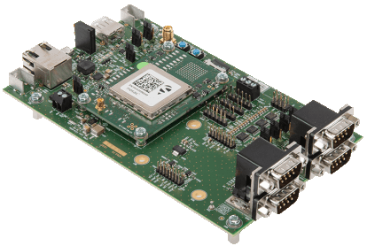
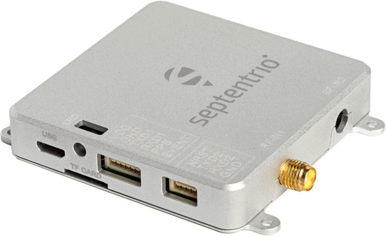

!!! danger
	!!! warning "ESD Sensitivity"
		The mosaic-X5 module is sensitive to [ESD](https://en.wikipedia.org/wiki/Electrostatic_discharge "Electrostatic Discharge"). Use a proper grounding system to make sure that the working surface and the components are at the same electric potential.

		??? info "ESD Precaution"
			As recommended by the manufacturer, we highly recommend that users take the necessary precautions to avoid damaging their module.

			

			- 

				<article class="video_cards">
				<iframe src="https://www.youtube.com/embed/hrL5J6Q5gX8?si=jOPBat8rzMnL7Uz4&amp;start=26;&amp;end=35;" title="Septentrio: Getting Started Video (playback starts at ESD warning)" frameborder="0" allow="accelerometer; autoplay; clipboard-write; encrypted-media; gyroscope; picture-in-picture" allowfullscreen></iframe>
				</article>
				

			-   - The Tri-band GNSS RTK breakout board features ESD protection on the USB-C connector and breakout's I/O:

					- USB data lines
					- I/O PTH pads
					- JST connector's pins
				- The mosaic-X5 module features internal ESD protection to the `ANT_1` antenna input.

			

	!!! warning "Active Antenna"
		Never inject an external DC voltage into the SMA connector for the GPS antenna, as it may damage the mosaic-X5 module. For instance, when using a splitter to distribute the antenna signal to several GNSS receivers, make sure that no more than one output of the splitter passes DC. Use [DC-blocks](https://en.wikipedia.org/wiki/DC_block) otherwise.

		??? info
			A 3 - 5.5V DC voltage can be applied to the main antenna from the `VANT` pin, obviating the need for an external antenna supply or [bias-tee](https://en.wikipedia.org/wiki/Bias_tee).

# Introduction

-   <a href="https://www.sparkfun.com/products/23088">
	**mosaic-X5 GNSS Breakout** 
	**SKU:** GPS-23088

	---

	<figure markdown>
	
	</figure></a>

	

	<article class="video_desc">
	<iframe src="https://www.youtube.com/embed/TSkIvtaVZc0" title="Product Showcase: SparkFun Tri-band GNSS RTK Breakout - mosaic-X5" frameborder="0" allow="accelerometer; autoplay; clipboard-write; encrypted-media; gyroscope; picture-in-picture" allowfullscreen></iframe>
	</article>
	{ .qr }

	[{ .tinyqr }&nbsp;&nbsp;Purchase from SparkFun :fontawesome-solid-cart-plus:{ .heart }](https://www.sparkfun.com/products/23088){ .md-button .md-button--primary }
	

-   At the heart of the Triband GNSS RTK Breakout is [Septentrio](https://www.septentrio.com/en)'s mosaic-X5, their most compact, ultra-low power, multi-band, multi-constellation, high-precision GNSS receiver. The receiver supports the GPS (USA), GLONASS (Russia), Beidou (China), Galileo (Europe), and NavIC (India) constellations, including regional systems *(i.e. SBAS and QZSS)*. With its [**Real Time Kinematics**](https://learn.sparkfun.com/tutorials/813) (RTK) capabilities, the module can achieve a horizontal accuracy of 6mm (~0.25in), vertical accuracy of 1cm (~0.4in) using RTK, and timing precision of 5ns (5 billionths of a second). It also features Septentrio's unique [AIM+ technology](https://www.septentrio.com/en/learn-more/advanced-positioning-technology/aim-jamming-protection) for interference mitigation and anti-spoofing, ensuring best-in-class reliability and scalable position accuracy.

	The mosaic-X5 is a sophisticated chip running an internal web server that can be accessed through the USB interface with a standard browser using a Linux/Windows computer. Septentrio also provides dozens of [video tutorials](https://www.youtube.com/@SeptentrioGNSS/videos) to guide users through the configuration settings of their GNSS receivers utilizing the web interface.

	Beyond the capabilities of the mosaic-X5 module, this board is seamless to operate with no programming skills required. Gone are the times when a microcontroller was required to interface with the GNSS receiver and log data to an SD card. The mosaic-X5 Triband GNSS RTK Breakout can start/stop logging data, without a single line of code, just utilizing a simple button.

	This breakout board is a perfect middle ground for users who would like to integrate the mosaic-X5 module into a project/enclosure with access to a majority of the module's available pins, similar to Septentrio's developer kit, but in the smaller form factor of their evaluation kit. Or maybe... you just needed a PPS output at a 3.3V logic level. *Please, check out the rest ouf our guide for more details on the capabilities of this board (that we couldn't fit in this product description).*

??? danger "Important: Read Before Use!"
	!!! warning "ESD Sensitivity"
		The mosaic-X5 module is sensitive to [ESD](https://en.wikipedia.org/wiki/Electrostatic_discharge "Electrostatic Discharge"). Use a proper grounding system to make sure that the working surface and the components are at the same electric potential.

		??? info "ESD Precaution"
			As recommended by the manufacturer, we highly recommend that users take the necessary precautions to avoid damaging their module.

			

			- 

				<article class="video_cards">
				<iframe src="https://www.youtube.com/embed/hrL5J6Q5gX8?si=jOPBat8rzMnL7Uz4&amp;start=26;&amp;end=35;" title="Septentrio: Getting Started Video (playback starts at ESD warning)" frameborder="0" allow="accelerometer; autoplay; clipboard-write; encrypted-media; gyroscope; picture-in-picture" allowfullscreen></iframe>
				</article>
				

			-   - The Tri-band GNSS RTK breakout board features ESD protection on the USB-C connector and breakout's I/O:

					- USB data lines
					- I/O PTH pads
					- JST connector's pins
				- The mosaic-X5 module features internal ESD protection to the `ANT_1` antenna input.

			

	!!! warning "Active Antenna"
		Never inject an external DC voltage into the SMA connector for the GPS antenna, as it may damage the mosaic-X5 module. For instance, when using a splitter to distribute the antenna signal to several GNSS receivers, make sure that no more than one output of the splitter passes DC. Use [DC-blocks](https://en.wikipedia.org/wiki/DC_block) otherwise.

		??? info
			A 3 - 5.5V DC voltage can be applied to the main antenna from the `VANT` pin, obviating the need for an external antenna supply or [bias-tee](https://en.wikipedia.org/wiki/Bias_tee).

??? question "Product Comparison"
	Below is a simple comparison table between our breakout board and Septentrio's development and evaluation kits:

	

	<table markdown>
	<tr markdown>
	<td></td>
	<th markdown style="text-align:center">
		mosaic-X5 Development Kit 
		

		<figure markdown>
		{ width="200" }
		</figure>
	</th>
	<th markdown style="text-align:center">
		mosaic-go Evaluation Kit 
		

		<figure markdown>
		{ width="200" }
		</figure>
	</th>
	<th markdown style="text-align:center">
		mosaic-X5 GNSS Breakout 
		

		<figure markdown>
		{ width="200" }
		</figure>
	</th>
	<th markdown style="text-align:center">
		RTK mosaic-X5 
		

		<figure markdown>
		{ width="200" }
		</figure>
	</th>
	</tr>
	<tr>
		<td style="vertical-align:middle;">GNSS Antenna</td>
		<td style="text-align:center; vertical-align:middle;">Dual</td>
		<td style="text-align:center">
			Single (mosaic-X5) 
			Dual (mosaic-H)
		</td>
		<td style="text-align:center; vertical-align:middle;">Single</td>
		<td style="text-align:center; vertical-align:middle;">Single</td>
	</tr>
	<tr>
		<td>USB Connector</td>
		<td style="text-align:center">micro-B</td>
		<td style="text-align:center">micro-B</td>
		<td style="text-align:center">Type-C</td>
		<td style="text-align:center">Type-C</td>
	</tr>
	<tr>
		<td style="vertical-align:middle;">Ethernet</td>
		<td style="text-align:center; vertical-align:middle;">
			Yes 
			<i>10/100 Base-T</i>
		</td>
		<td style="text-align:center; vertical-align:middle;">No</td>
		<td style="text-align:center; vertical-align:middle;">No</td>
		<td style="text-align:center">
			Yes 
			<i>10/100 Base-T</i>
		</td>
	</tr>
	<tr>
		<td style="vertical-align:middle;">WiFi</td>
		<td style="text-align:center; vertical-align:middle;">No</td>
		<td style="text-align:center; vertical-align:middle;">No</td>
		<td style="text-align:center; vertical-align:middle;">No</td>
		<td style="text-align:center">
			Yes - Network Bridge 
			<i>10 Base-T</i>
		</td>
	</tr>
	<tr>
		<td style="vertical-align:middle;">COM Ports</td>
		<td style="text-align:center">4</td>
		<td style="text-align:center">2</td>
		<td style="text-align:center">4</td>
		<td style="text-align:center">
			1 - mosaic-X5 
			1 - ESP32
		</td>
	</tr>
	<tr>
		<td>&micro;SD Card Slot</td>
		<td style="text-align:center">Yes</td>
		<td style="text-align:center">Yes</td>
		<td style="text-align:center">Yes</td>
		<td style="text-align:center">Yes</td>
	</tr>
	<tr>
		<td style="vertical-align:middle;">Reset/Log Buttons</td>
		<td style="text-align:center; vertical-align:middle;">Yes</td>
		<td style="text-align:center; vertical-align:middle;">No*</td>
		<td style="text-align:center; vertical-align:middle;">Yes</td>
		<td style="text-align:center; vertical-align:middle;">Yes</td>
	</tr>
	<tr>
		<td style="vertical-align:middle;">Logic-Level</td>
		<td style="text-align:center">
			1.8V 
			3.3V
		</td>
		<td style="text-align:center; vertical-align:middle;">3.3V</td>
		<td style="text-align:center; vertical-align:middle;">3.3V</td>
		<td style="text-align:center">
			3.3V 
			5V
		</td>
	</tr>
	<tr>
		<td>PPS Signal</td>
		<td style="text-align:center">Header Pin</td>
		<td style="text-align:center">6-Pin JST Connector</td>
		<td style="text-align:center">SMA Connector</td>
		<td style="text-align:center">Screw Terminal</td>
	</tr>
	<tr>
		<td>Enclosure Material</td>
		<td style="text-align:center; vertical-align:middle;">N/A</td>
		<td style="text-align:center; vertical-align:middle;">Metal</td>
		<td style="text-align:center; vertical-align:middle;">N/A</td>
		<td style="text-align:center; vertical-align:middle;">Aluminum</td>
	</tr>
	<tr>
		<td style="vertical-align:middle;">Dimensions</td>
		<td style="text-align:center; vertical-align:middle;">N/A</td>
		<td style="text-align:center; vertical-align:middle;">71 x 59 x 12mm ± 1mm</td>
		<td style="text-align:center; vertical-align:middle;">70.9 x 50.8 x 8mm</td>
		<td style="text-align:center">
			180.6 x 101.8 x 41mm 
			<i>Enclosure Only</i>
		</td>
	</tr>
	<tr>
		<td style="vertical-align:middle;">Weight</td>
		<td style="text-align:center; vertical-align:middle;">N/A</td>
		<td style="text-align:center; vertical-align:middle;">58g  ± 1g</td>
		<td style="text-align:center; vertical-align:middle;">22.6g</td>
		<td style="text-align:center">
			415.15g 
			<i>Enclosure Only</i>
		</td>
	</tr>
	
	</table>
	
	

	!!! note "mosaic-go Evaluation Kit"
		The reset pin is exposed on 4-pin JST connector and the log pin is connected to the latch pin of the SD card slot.

## :fontawesome-solid-list-check:&nbsp;Required Materials
To get started, users will need a few items. Now some users may already have a few of these items, feel free to modify your cart accordingly.

* Computer with an operating system (OS) that is compatible with all the software installation requirements (1)

	!!! warning "Software Compatibility"
		The [RxTools software suite](https://www.septentrio.com/en/products/gps-gnss-receiver-software/rxtools) from Septentrio, automatically installs the required USB-over-Ethernet driver and provides users with an interface for the receiver configuration, monitoring, data logging, and analysis. However, it only appears to be available for Windows and Linux operating systems.

* [USB 3.1 Cable A to C - 3 Foot](https://www.sparkfun.com/products/14743) - Used to interface with the mosaic-X5 GNSS Breakout (2)
* [SparkFun Tri-band GNSS RTK Breakout - mosaic-X5](https://www.sparkfun.com/products/23088) (3)
* [GNSS Multi-Band L1/L2/L5 Surveying Antenna](https://www.sparkfun.com/products/21801)
	* [SMA Male to TNC Male Cable](https://www.sparkfun.com/products/21740)
	* [Antenna Mount](https://www.sparkfun.com/products/21257)

1. A list of the compatible GNSS receiver software, is provided on the [Septentrio website](https://www.septentrio.com/en/products/gps-gnss-receiver-software).
2. If your computer doesn't have a USB-A slot, then choose an appropriate cable or adapter.
3. For the best performance, use a compatible L1/L2/L5 GNSS antenna.

-   <a href="https://www.sparkfun.com/products/14743">
	<figure markdown>
	
	</figure>

	---

	**USB 3.1 Cable A to C - 3 Foot** 
	CAB-14743</a>

-   <a href="https://www.sparkfun.com/products/23088">
	<figure markdown>
	
	</figure>

	---

	**mosaic-X5 (Tri-band + RTK) GNSS Breakout** 
	GPS-23088</a>

-   <a href="https://www.sparkfun.com/products/21801">
	<figure markdown>
	
	</figure>		

	---

	**GNSS Multi-Band L1/L2/L5 Surveying Antenna - TNC (SPK6618H)** 
	GPS-21801</a>

-   <a href="https://www.sparkfun.com/products/21740">
	<figure markdown>
	
	</figure>

	---

	**Reinforced Interface Cable - SMA Male to TNC Male (10m)** 
	CAB-21740</a>

-   <a href="https://www.sparkfun.com/products/21257">
	<figure markdown>
	
	</figure>		

	---

	**GNSS Magnetic Antenna Mount - 5/8" 11-TPI** 
	PRT-21257</a>

!!! danger "ESD Protection"
	The Septentrio mosaic-X5 module is sensitive to [ESD](https://en.wikipedia.org/wiki/Electrostatic_discharge "Electrostatic Discharge"). Use a proper grounding system to make sure that the working surface and the components are at the same electric potential.

	

	- 

		<article class="video_cards">
		<iframe src="https://www.youtube.com/embed/hrL5J6Q5gX8?si=jOPBat8rzMnL7Uz4&amp;start=26;&amp;end=35;" title="Septentrio: Getting Started Video (playback starts at ESD warning)" frameborder="0" allow="accelerometer; autoplay; clipboard-write; encrypted-media; gyroscope; picture-in-picture" allowfullscreen></iframe>
		</article>
		

		!!! warning
			As recommended by the manufacturer, we highly recommend that users take the necessary precautions to avoid damaging their module.

	-   <a href="https://www.sparkfun.com/products/15255">
		<figure markdown>
		
		</figure>		

		---

		**iFixit Pro Tech Toolkit** 
		TOL-15255</a>

	

??? note "Antennas & Accessories"
	For the best performance, we recommend users choose a compatible L1/L2/L5 (tri-band) GNSS antenna and utilize a low-loss cable. For additional options, please check out the [GPS Antenna](https://www.sparkfun.com/categories/18) category of our product catalog.

	=== "L5 Antennas"
	
		

		-   <a href="https://www.sparkfun.com/products/21801">
			<figure markdown>
			
			</figure>		

			---

			**GNSS Multi-Band L1/L2/L5 Surveying Antenna - TNC (SPK6618H)** 
			GPS-21801</a>

			??? info "Adapter Cable"
				For our TNC antennas, users will need a TNC to SMA adapter cable.
		
				

		
				-   <a href="https://www.sparkfun.com/products/17833">
					<figure markdown>
					
					</figure>		
		
					---
		
					**Interface Cable - SMA Male to TNC Male (300mm)** 
					CAB-17833</a>
		
				-   <a href="https://www.sparkfun.com/products/21739">
					<figure markdown>
					
					</figure>
		
					---
		
					**Reinforced Interface Cable - SMA Male to TNC Male (300mm)** 
					CAB-21739</a>
		
				-   <a href="https://www.sparkfun.com/products/21740">
					<figure markdown>
					
					</figure>
		
					---
		
					**Reinforced Interface Cable - SMA Male to TNC Male (10m)** 
					CAB-21740</a>
		
				

		-   <a href="https://www.sparkfun.com/products/15192">
			<figure markdown>
			
			</figure>

			---

			**GNSS Multi-Band Magnetic Mount Antenna - 5m (SMA)** 
			GPS-15192</a>

			??? info "Kit Version"
				We also offer this product in a kit, which includes a ground plate and USB-C cable.

				

				-   <a href="https://www.sparkfun.com/products/18293">
					<figure markdown>
					
					</figure>		

					---

					**SparkFun GNSS-RTK Accessory Kit** 
					KIT-18293</a>

				

		-   <a href="https://www.sparkfun.com/products/17108">
			<figure markdown>
			
			</figure>

			---

			**MagmaX2 Active Multiband GNSS Magnetic Mount Antenna - AA.200** 
			GPS-17108</a>

		

	=== "Mounting Hardware"

		

		-   <a href="https://www.sparkfun.com/products/21257">
			<figure markdown>
			
			</figure>		

			---

			**GNSS Magnetic Antenna Mount - 5/8" 11-TPI** 
			PRT-21257</a>

			!!! info "5/8"-11 TPI"
				This product is meant to be used with our surveying antennas. To mount those antennas to a camera tripod, check out our [tripod adapter](https://www.sparkfun.com/products/17546).

		-   <a href="https://www.sparkfun.com/products/22197">
			<figure markdown>
			
			</figure>		

			---

			**GNSS Antenna Mounting Hardware Kit** 
			KIT-22197</a>

			!!! info "5/8"-11 TPI"
				This product is meant to be used with our surveying antennas. To mount those antennas to a camera tripod, check out our [tripod adapter](https://www.sparkfun.com/products/17546).

		-   <a href="https://www.sparkfun.com/products/17519">
			<figure markdown>
			
			</figure>		

			---

			**GPS Antenna Ground Plate** 
			GPS-17519</a>

			!!! info "1/4"-20 TPI"
				This product is meant to be used with our magnetic antennas and a camera tripod with a standard ¼"-20 UNC camera mounting screw.

		

??? note "Data Logging"
	The Septentrio mosaic-X5 module is capable of logging data to an &micro;SD card. Please check out the [memory cards and accessories](https://www.sparkfun.com/categories/351) in our product catalog.

	

	-   <a href="https://www.sparkfun.com/products/15107">
		<figure markdown>
		
		</figure>		

		---

		**microSD Card - 1GB (Class 4)** 
		COM-15107</a>

	-   <a href="https://www.sparkfun.com/products/13004">
		<figure markdown>
		
		</figure>		

		---

		**microSD USB Reader** 
		COM-13004</a>

	

??? note "JST Cable & Transceivers"
	In remote applications, users may need to utilize one of our radio transceivers for RTK correction data. Users may also find our breadboard cable convenient for connecting your module to a development board.

	

	-   <a href="https://www.sparkfun.com/products/19032">
		<figure markdown>
		
		</figure>

		---

		**SiK Telemetry Radio V3 - 915MHz, 100mW** 
		WRL-19032</a>

	-   <a href="https://www.sparkfun.com/products/20029">
		<figure markdown>
		
		</figure>

		---

		**SparkFun LoRaSerial Kit - 915MHz (Enclosed)** 
		WRL-20029</a>

	-   <a href="https://www.sparkfun.com/products/18079">
		<figure markdown>
		
		</figure>

		---

		**Breadboard to JST-GHR-06V Cable - 6-Pin x 1.25mm Pitch** 
		CAB-18079</a>

	-   <a href="https://www.sparkfun.com/products/12044">
		<figure markdown>
		
		</figure>

		---

		**Breadboard - Mini Modular (Red)** 
		PRT-12044</a>

	

??? note "Headers and Wiring"
	To add headers or hookup wires, users will need [soldering equipment](https://www.sparkfun.com/categories/49) and [headers](https://www.sparkfun.com/categories/381)/[wire](https://www.sparkfun.com/search/results?term=hook-up+wire).

	!!! tip "New to soldering?"
		Check out our [How to Solder: Through-Hole Soldering](https://learn.sparkfun.com/tutorials/5) tutorial for a quick introduction!

		

		-   <a href="https://learn.sparkfun.com/tutorials/5">
			<figure markdown>
			
			</figure>

			---
	
			**How to Solder: Through-Hole Soldering**</a>

		

	

	-   <a href="https://www.sparkfun.com/products/9325">
		<figure markdown>
		
		</figure>		

		---

		**Solder Lead Free - 100-gram Spool** 
		TOL-09325</a>

	-   <a href="https://www.sparkfun.com/products/24063">
		<figure markdown>
		
		</figure>

		---
		
		**PINECIL Soldering Iron Kit** 
		KIT-24063</a>

	-   <a href="https://www.sparkfun.com/products/14579">
		<figure markdown>
		
		</figure>

		---

		**Chip Quik No-Clean Flux Pen - 10mL** 
		TOL-14579</a>

	-   <a href="https://www.sparkfun.com/products/116">
		<figure markdown>
		
		</figure>

		---

		**Break Away Headers - Straight** 
		PRT-00116</a>

	-   <a href="https://www.sparkfun.com/products/11375">
		<figure markdown>
		
		</figure>

		---

		**Hook-Up Wire - Assortment (Stranded, 22 AWG)** 
		PRT-11375</a>

	

??? note "Jumper Modification"
	To modify the [jumpers](../hardware_overview/#jumpers), users will need [soldering equipment](https://www.sparkfun.com/categories/49) and/or a [hobby knife](https://www.sparkfun.com/categories/379).

	!!! tip "New to jumper pads?"
		Check out our [Jumper Pads and PCB Traces Tutorial](https://learn.sparkfun.com/tutorials/664) for a quick introduction!

		

		-   <a href="https://learn.sparkfun.com/tutorials/664">
			<figure markdown>
			
			</figure>

			---
			
			**How to Work with Jumper Pads and PCB Traces**</a>

		

	

	-   <a href="https://www.sparkfun.com/products/9325">
		<figure markdown>
		
		</figure>		

		---

		**Solder Lead Free - 100-gram Spool** 
		TOL-09325</a>

	-   <a href="https://www.sparkfun.com/products/22265">
		<figure markdown>
		
		</figure>

		---

		**SparkFun Beginner Tool Kit** 
		TOL-22265</a>

	-   <a href="https://www.sparkfun.com/products/14579">
		<figure markdown>
		
		</figure>

		---

		**Chip Quik No-Clean Flux Pen - 10mL** 
		TOL-14579</a>

	-   <a href="https://www.sparkfun.com/products/9200">
		<figure markdown>
		
		</figure>

		---

		**Hobby Knife** 
		TOL-09200</a>

	

## :material-bookshelf:&nbsp;Suggested Reading

As a more sophisticated product, we will skip over the more fundamental tutorials (i.e. [**Ohm's Law**](https://learn.sparkfun.com/tutorials/voltage-current-resistance-and-ohms-law) and [**What is Electricity?**](https://learn.sparkfun.com/tutorials/what-is-electricity)). However, below are a few tutorials that may help users familiarize themselves with various aspects of the board.

!!! tip
	Check out the [www.gps.gov](https://www.gps.gov/) website to learn more about the U.S.-owned [Global Positioning System (GPS)](https://www.gps.gov/systems/gps/) and the [Global Navigation Satellite Systems (GNSS) of other countries](https://www.gps.gov/systems/gnss/).

-   <a href="https://learn.sparkfun.com/tutorials/9">
	<figure markdown>
	
	</figure>

	---

	**GPS Basics**</a>

-   <a href="https://learn.sparkfun.com/tutorials/813">
	<figure markdown>
	
	</figure>

	---

	**What is GPS RTK?**</a>

-   <a href="https://docs.sparkfun.com/SparkFun_RTK_mosaic-X5">
	<figure markdown>
	
	</figure>

	---

	**RTK mosaic-X5 Hookup Guide**</a>

-   <a href="https://learn.sparkfun.com/tutorials/8">
	<figure markdown>
	
	</figure>

	---

	**Serial Communication**</a>

-   <a href="https://learn.sparkfun.com/tutorials/112">
	<figure markdown>
	
	</figure>

	---

	**Serial Terminal Basics**</a>

-   <a href="https://learn.sparkfun.com/tutorials/36">
	<figure markdown>
	
	</figure>

	---

	**How to Power a Project**</a>

-   <a href="https://learn.sparkfun.com/tutorials/5">
	<figure markdown>
	
	</figure>

	---

	**How to Solder: Through-Hole Soldering**</a>

-   <a href="https://learn.sparkfun.com/tutorials/664">
	<figure markdown>
	
	</figure>

	---

	**How to Work with Jumper Pads and PCB Traces**</a>

??? info "Related Blog Posts"
	Additionally, users may be interested in these blog post articles on GNSS technologies:

	

	-   <a href="https://www.sparkfun.com/news/4276">
		<figure markdown>
		
		</figure>

		---

		**GPS vs GNSS**</a>
	
	-   <a href="https://www.sparkfun.com/news/7138">
		<figure markdown>
		
		</figure>

		---

		**What is Correction Data?**</a>
	
	-   <a href="https://www.sparkfun.com/news/7533">
		<figure markdown>
		
		</figure>

		---

		**Real-Time Kinematics Explained**</a>
	
	-   <a href="https://www.sparkfun.com/news/7401">
		<figure markdown>
		
		</figure>

		---

		**New Video: Unlocking High-Precision RTK Positioning**</a>

	-   <a href="https://www.sparkfun.com/news/9514">
		<figure markdown>
		
		</figure>

		---

		**DIY RTK Surveying**</a>

	

