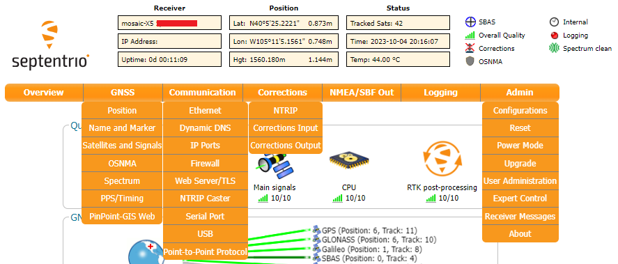

!!! danger "Important: Read Before Use!"
	!!! warning "ESD Sensitivity"
		The mosaic-X5 module is sensitive to [ESD](https://en.wikipedia.org/wiki/Electrostatic_discharge "Electrostatic Discharge"). Use a proper grounding system to make sure that the working surface and the components are at the same electric potential.

		??? info "ESD Precaution"
			As recommended by the manufacturer, we highly recommend that users take the necessary precautions to avoid damaging their module.

			- The Tri-band GNSS RTK breakout board features ESD protection on the USB-C connector and breakout's I/O:
				- USB data lines
				- I/O PTH pads
				- JST connector's pins
			- The mosaic-X5 module features internal ESD protection to the `ANT_1` antenna input.

			

			

			<article style="text-align: center;" markdown>
			<article class="video-500px">
			<iframe src="https://www.youtube.com/embed/hrL5J6Q5gX8?si=jOPBat8rzMnL7Uz4&amp;start=26;&amp;end=35;" title="Septentrio: Getting Started Video (playback starts at ESD warning)" frameborder="0" allow="accelerometer; autoplay; clipboard-write; encrypted-media; gyroscope; picture-in-picture" allowfullscreen></iframe>
			</article>
			</article>

			

			-   <a href="https://www.sparkfun.com/products/25572">
				<figure markdown>
				
				</figure>		

				---

				**iFixit Anti-Static Wrist Strap** 
				TOL-25572</a>

			

!!! note
	The mosaic-X5 module has numerous capabilities and a multitude of ways to configure and interface with them. Without regurgitating all the information that is documented in Septentrio's user manuals and videos, we have tried to highlight a good majority of the module's aspects.

	With that said, please feel free to [file an issue](../github/file_issue/#discrepancies-in-the-documentation) if you feel we have missed something that may benefit other users. *(Don't forget to provide us with a link to the documentation and what section the information is located.)*

## USB Driver
=== "Windows"
	If users haven't already installed the [RxTools software suite](https://www.septentrio.com/en/products/gps-gnss-receiver-software/rxtools) on their Windows PC, they will need to install the USB driver[^1] necessary to recognize and interact with the mosaic-X5 module through the USB interface.

	[^1]: On Linux, the standard Linux CDC-ACM driver is suitable.

	A Windows USB driver for the mosaic-X5 can be installed through two methods:

	

	* RxTools Software Suite (1)
	* mosaic-X5 GNSS Receiver Module (2)

	

	1. The driver is installed during the installation process.
	2. The installation file for the Windows USB driver will be available from the mass-storage device when the board is initially connected to the computer.

	Once installed, the driver emulates two virtual serial ports, which can be accessed as standard `COM` ports to the receiver.

	??? tip "Terminal Emulators"
		Most [terminal emulation programs](https://learn.sparkfun.com/tutorials/112) will not make a distinction between virtual or native COM ports. However, for virtual serial ports, the port settings *(i.e. baudrate, etc.)* are not relevant and the default configuration be used in the terminal emulation program. However, for the physical/native `COM` ports will have the following default setting: 

		* Baudrate: 115200bps
		* Data Bits: 8
		* Parity: No
		* Stop Bits: 1
		* Flow Control: None

	??? tip "Having Trouble?"
		For users who are having trouble installing the USB driver, we have an archived version *(v3.0.2[^2])* of the installation file. Users can download [**version 3.0.2**](./assets/component_documentation/driver/USB_driver_3_0_2_Installer.exe) of the driver, by clicking on the button below.

		[^2]:
			For the latest USB driver from Septentrio, please install their driver through the [RxTools software suite](../rxtools). 
			*This is driver version, was archived at the time that this guide was written. Please do not request for the file to be updated.*

		<article style="text-align: center;" markdown>
		[:octicons-download-16:{ .heart } Download USB Driver *(v3.0.2)*](./assets/component_documentation/driver/USB_driver_3_0_2_Installer.exe){ .md-button .md-button--primary target="blank" }
		</article>

=== "Linux"
	On Linux, the standard Linux CDC-ACM driver is suitable.

## Web Interface
With the USB driver installed, the mosaic-X5 module supports Ethernet-over-USB. The default IP address allocated for the Ethernet-over-USB interface is `192.168.3.1`. This IP can be entered in any browser to open a connection to the receiver's Web Interface as shown below.

<figure markdown>
[{ width="600" }](./assets/img/hookup_guide/navigation_tabs.png "Click to enlarge")
<figcaption markdown>All the drop-down navigation tabs in the web interface.</figcaption>
</figure>

<article style="text-align: center;" markdown>
<article class="video-500px">
<iframe src="https://www.youtube.com/embed/hrL5J6Q5gX8" title="Septentrio: Getting started with the Septentrio mosaic receiver module" frameborder="0" allow="accelerometer; autoplay; clipboard-write; encrypted-media; gyroscope; picture-in-picture" allowfullscreen></iframe>
</article>
</article>

!!! info
	The default IP address cannot be changed; this feature is only to be used when a single receiver is connected to your computer.

??? failure "Invalid IP Address *(WiFi Only)*"
	[One of the documentation pages on Septentrio's website](https://customersupport.septentrio.com/s/article/What-is-the-default-IP-address-to-connect-via-WiFi), specifies a default IP address of `192.168.20.1` for the web interface. However, that address is for a WiFi enabled product and cannot be used with this product.

### Update the Module's Firmware
!!! info "Latest Firmware"
	For the latest firmware released by Septentrio, please visit their [product page](https://www.septentrio.com/en/products/gps/gnss-receiver-modules/mosaic-x5#resources) for the mosaic-X5 module.

-   To check for the latest firmware published by Septentrio, please visit their [product page](https://www.septentrio.com/en/products/gps/gnss-receiver-modules/mosaic-x5#resources) for the mosaic-X5 module. Users can click on the button below, to be redirected to the latest firmware for the mosaic-X5.

	<article style="text-align: center;" markdown>
	[:septentrio-logo: Find the Latest Firmware](https://www.septentrio.com/en/products/gps/gnss-receiver-modules/mosaic-x5#resources){ .md-button .md-button--primary target="blank" }
	</article>

-   Currently, at the time that this board was released, the firmware for the mosaic-X5 module was *v4.15.0*[^4]. Users can download [**version 4.15.0**](./assets/component_documentation/firmware/mosaic-X5_fwp_4.15.0.zip) of the firmware, by clicking on the button below.

	[^4]:
		For the latest firmware published by Septentrio, please visit their [product page](https://www.septentrio.com/en/products/gps/gnss-receiver-modules/mosaic-x5#resources). 
		*This is firmware version, was archived at the time that this guide was written. Please do not request for the file to be updated; instead visit the product page to download the latest firmware.*

	<article style="text-align: center;" markdown>
	[:octicons-download-16:{ .heart } Download Firmware *(v4.15.0)*](./assets/component_documentation/firmware/mosaic-X5_fwp_4.15.0.zip){ .md-button .md-button--primary target="blank" }
	</article>

<article style="text-align: center;" markdown>
<article class="video-500px">
<iframe src="https://www.youtube.com/embed/bp8kNbzMl_c" title="Septentrio: How to upgrade the firmware of a Septentrio receiver" frameborder="0" allow="accelerometer; autoplay; clipboard-write; encrypted-media; gyroscope; picture-in-picture" allowfullscreen></iframe>
</article>
</article>

### GPS Data
Besides logging data with just the ++"LOG"++ button, users can configure/enable the output of data streams through the `COM` ports and data logging to the SD card through the web interface or RxTools software suite. The videos below illustrate how these features can be operated through the web interface.

#### Data Logging

This video illustrates how users can configure the settings for data logging to the SD card.

<article style="text-align: center;" markdown>
<article class="video-500px">
<iframe src="https://www.youtube.com/embed/Y9tvOebnoxk" title="Septentrio: How to log data to the SD card of the Septentrio mosaic receiver module" frameborder="0" allow="accelerometer; autoplay; clipboard-write; encrypted-media; gyroscope; picture-in-picture" allowfullscreen></iframe>
</article>
</article>

#### Stream Data

This video illustrates how users can configure and enable a data stream through a TCP/IP connection.

<article style="text-align: center;" markdown>
<article class="video-500px">
<iframe src="https://www.youtube.com/embed/ArtePkC58-o" title="Septentrio: How to output NMEA data on the Septentrio mosaic receiver module" frameborder="0" allow="accelerometer; autoplay; clipboard-write; encrypted-media; gyroscope; picture-in-picture" allowfullscreen></iframe>
</article>
</article>

??? info "Related Video"
	While this instructional video is for a different product line, the information, for the most part, is still relevant.

	<article style="text-align: center;" markdown>
	<article class="video-500px">
	<iframe src="https://www.youtube.com/embed/vU6iwJ-ac6A" title="Septentrio: How to log and stream data in NMEA OR SBF format for GNSS/INS receivers" frameborder="0" allow="accelerometer; autoplay; clipboard-write; encrypted-media; gyroscope; picture-in-picture" allowfullscreen></iframe>
	</article>
	</article>

### RTK Corrections

For users with multiple RTK capable GNSS receivers, users can configure their mosaic-X5 as a rover or base station.

<article style="text-align: center;" markdown>
<article class="video-500px">
<iframe src="https://www.youtube.com/embed/UVUVXpA8rB4" title="Septentrio: How to receive corrections over an IP connection" frameborder="0" allow="accelerometer; autoplay; clipboard-write; encrypted-media; gyroscope; picture-in-picture" allowfullscreen></iframe>
</article>
</article>

Without having to setup a personal base station, users can receive RTK corrections through the internet from 3rd-party services.

<article style="text-align: center;" markdown>
<article class="video-500px">
<iframe src="https://www.youtube.com/embed/aAPoRpSR0tY" title="Septentrio: How to receive corrections via NTRIP on the Septentrio mosaic receiver module" frameborder="0" allow="accelerometer; autoplay; clipboard-write; encrypted-media; gyroscope; picture-in-picture" allowfullscreen></iframe>
</article>
</article>

#### Sharing Internet Access
By default, the mosaic-X5 GNSS receiver is not configured to access the internet through the USB interface. In order to receive or cast RTK corrections to/from a RTK network, such as NTRIP, users will need to enable capability.

* Users will need to use the web interface or RxTool software suite to enable the `Outgoing Internet Access Over USB` from the **Communication** > **USB** drop-down menu of the navigation tabs.
* This also requires users to allowing Internet sharing through on their computer as weill. The procedure to do so depends on your operating system.
	* On a Windows PC, users must enable `Allow other network users to connect through this computer's Internet connection`, through the properties option of the network adapter with internet access.
	* On a Linux computer, users will likely need to configure a [network bridge](https://en.wikipedia.org/wiki/Network_bridge).

<article style="text-align: center;" markdown>
<article class="video-500px">
<iframe src="https://www.youtube.com/embed/bUt8cL9Ue1Y" title="Septentrio: Share internet connection with your GNSS / GPS receiver over USB" frameborder="0" allow="accelerometer; autoplay; clipboard-write; encrypted-media; gyroscope; picture-in-picture" allowfullscreen></iframe>
</article>
</article>

!!! info "New IP Address"
	Once a network bridge is enabled, the receiver will receive its IP address from the computer's DHCP server. Depending on the routing table, the module may no longer be reachable at its default IP address *(`192.168.3.1`)*.

### Enable the L5 Band
The mosaic-X5 is capable of utilizing the `L5` frequency band. However, within the GPS network, the `L5` service isn't completely operational and is currently marked as `unhealthy`. Users will need to configure the mosaic-X5 to enable the `L5` frequency band.

From the **Admin** tab, navigate through the drop-down menu to **Admin** > **Expert Control** > **Control Panel** > **Navigation** > **Receiver Operation** > **Masks**. Find the **Health Masks** box, and configure the `Discard unhealthy satellites` feature to `off` for both the **Tracking** and **PVT** options.

<figure markdown>
[{ width="400" }](./assets/img/hookup_guide/L5_step1.png "Click to enlarge")
<figcaption markdown>
Configuring the `Discard unhealthy satellites` feature to `off`.
</figcaption>
</figure>

!!! note
	Make sure to click ++"OK"++ button at the bottom of each page, to save and update the current configuration. Also, the save it to boot option will enable the configuration to persist through power cycles.

From the **Navigation** tab, navigate through the drop-down menu to **Navigation** > **Advance User Settings** > **Tracking** > **Signal Tracking**. Find the **Signal Tracking** box, then enable the `GPSL5` option.

<figure markdown>
[{ width="400" }](./assets/img/hookup_guide/L5_step2.png "Click to enlarge")
<figcaption markdown>
Enabling signal tracking of the `L5` frequency band for the GPS constellation.
</figcaption>
</figure>

??? tip "Click ++"OK"++"
	Don't forget to click ++"OK"++ button at the bottom of the page to save and update the current configuration.

Again in the **Navigation** tab, navigate to **Navigation** > **Advance User Settings** > **PVT** > **Signal Usage**. Enable the `GPSL5` option in both **Signals enabled in the PVT** and **Signals enabled in the navigation data decoder** sections.

<figure markdown>
[{ width="400" }](./assets/img/hookup_guide/L5_step3.png "Click to enlarge")
<figcaption markdown>
Enabling signal usage of the `L5` frequency band for the GPS constellation.
</figcaption>
</figure>

??? tip "Click ++"OK"++"
	Don't forget to click ++"OK"++ button at the bottom of the page to save and update the current configuration.

### More Videos
Users can find other instructional videos on [Septentrio's YouTube Channel](https://www.youtube.com/channel/UCrA9wMw1y1f-KeOnnhq4lrA/). Feel free to check out their playlists as well:

* [Getting Started](https://www.youtube.com/playlist?list=PLUxLg2_PvvdE0e2i2std6XyPnF6UdecAD)
* [How to *(Videos)* ](https://www.youtube.com/playlist?list=PLUxLg2_PvvdHZ73CnfhS7ZePIIIUR7bON)

??? note "Other Videos"

	

	

	<article class="video-300px">
	<iframe src="https://www.youtube.com/embed/j_zHbl99FsI" title="Septentrio: How to reset a receiver" frameborder="0" allow="accelerometer; autoplay; clipboard-write; encrypted-media; gyroscope; picture-in-picture" allowfullscreen></iframe>
	</article>

	

	

	<article class="video-300px">
	<iframe src="https://www.youtube.com/embed/D-iqzQnDbWw" title="Septentrio: How to copy the configuration from one to another receiver" frameborder="0" allow="accelerometer; autoplay; clipboard-write; encrypted-media; gyroscope; picture-in-picture" allowfullscreen></iframe>
	</article>

	

	

	<article class="video-300px">
	<iframe src="https://www.youtube.com/embed/2XizOW3Dzzk" title="Septentrio: How to monitor the CPU of a Septentrio receiver" frameborder="0" allow="accelerometer; autoplay; clipboard-write; encrypted-media; gyroscope; picture-in-picture" allowfullscreen></iframe>
	</article>

	

	

	<article class="video-300px">
	<iframe src="https://www.youtube.com/embed/9qN6b1JC3uE" title="Septentrio: How to generate and save a diagnostic report of a Septentrio receiver" frameborder="0" allow="accelerometer; autoplay; clipboard-write; encrypted-media; gyroscope; picture-in-picture" allowfullscreen></iframe>
	</article>

	

	

	<article class="video-300px">
	<iframe src="https://www.youtube.com/embed/WU8MYrDALsE" title="Septentrio: How to log SBF data for support for Septentrio's GNSS/ GPS receivers" frameborder="0" allow="accelerometer; autoplay; clipboard-write; encrypted-media; gyroscope; picture-in-picture" allowfullscreen></iframe>
	</article>

	

	

	<article class="video-300px">
	<iframe src="https://www.youtube.com/embed/lAP3TXz0ZL8" title="Septentrio: How to set up the PX4 Pixhawk and the Septentrio mosaic-go GNSS receiver Instruction video" frameborder="0" allow="accelerometer; autoplay; clipboard-write; encrypted-media; gyroscope; picture-in-picture" allowfullscreen></iframe>
	</article>

	

	

	<article class="video-300px">
	<iframe src="https://www.youtube.com/embed/OdGE7bXgJck" title="Septentrio: How to set up ArduPilot with Septentrio AsteRx GNSS receiver + RIB and Pixhawk" frameborder="0" allow="accelerometer; autoplay; clipboard-write; encrypted-media; gyroscope; picture-in-picture" allowfullscreen></iframe>
	</article>

	

	

	<article class="video-300px">
	<iframe src="https://www.youtube.com/embed/SzI0skGHKEw" title="Septentrio: Anti-jamming feature test-run" frameborder="0" allow="accelerometer; autoplay; clipboard-write; encrypted-media; gyroscope; picture-in-picture" allowfullscreen></iframe>
	</article>

	

	

	<article class="video-300px">
	<iframe src="https://www.youtube.com/embed/H6uVVEJ5U5w" title="Septentrio: How to activate Wideband Interference Mitigation" frameborder="0" allow="accelerometer; autoplay; clipboard-write; encrypted-media; gyroscope; picture-in-picture" allowfullscreen></iframe>
	</article>

	

	

	<article class="video-300px">
	<iframe src="https://www.youtube.com/embed/Ib_B_KcfmPs" title="Septentrio: How to use the spectrum plot" frameborder="0" allow="accelerometer; autoplay; clipboard-write; encrypted-media; gyroscope; picture-in-picture" allowfullscreen></iframe>
	</article>

	

	

